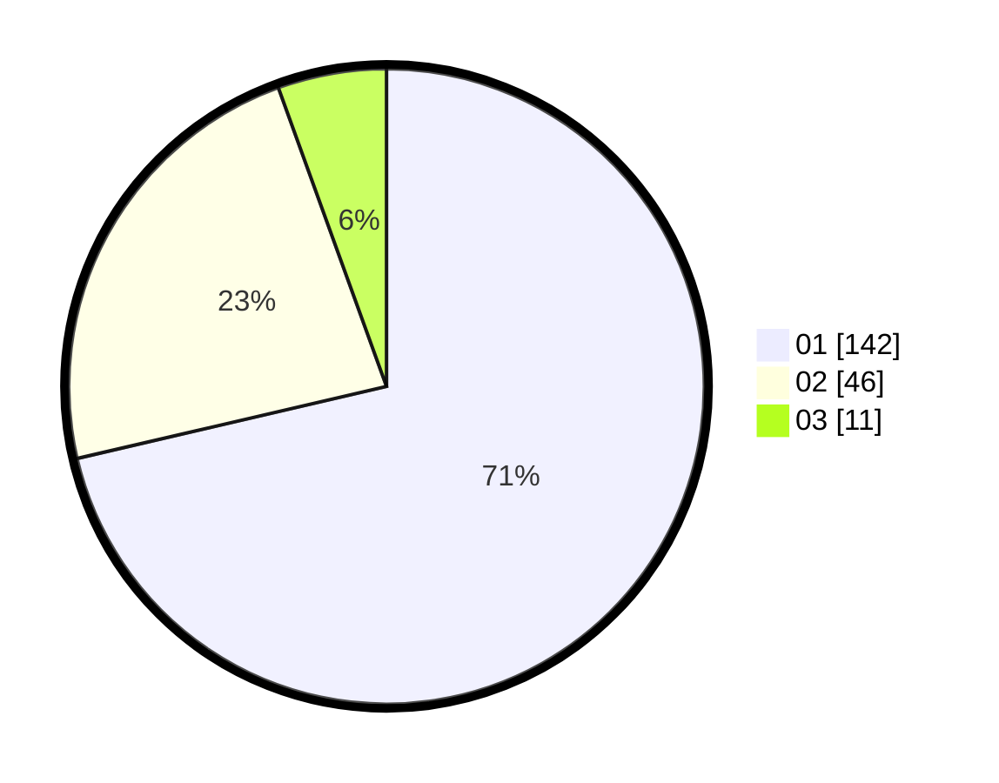

# Hasil

Hasil perolehan suara paslon dapat dilihat pada file paslon-01.txt, paslon-02.txt, dan paslon-03.txt.

Jika tidak ada, artinya data tersebut belum ada pada SIREKAP.

## Perolehan Suara

 * Paslon 01: **142**.
 * Paslon 02: **46**.
 * Paslon 03: **11**.

## Foto C Plano

https://sirekap-obj-formc.kpu.go.id/b668/pemilu/ppwp/31/71/07/10/04/3171071004008-20240214-155112--8b2f88bf-6611-4690-a359-c4483fc44a32.jpg

https://sirekap-obj-formc.kpu.go.id/b668/pemilu/ppwp/31/71/07/10/04/3171071004008-20240214-155747--757501eb-9655-43a2-a92c-37191aabf7fd.jpg

https://sirekap-obj-formc.kpu.go.id/b668/pemilu/ppwp/31/71/07/10/04/3171071004008-20240214-162234--54083d46-eeac-4cfb-8172-a9f14b88978b.jpg

## DATA PEMILIH TETAP

Jumlah pemilih dalam DPT: **270**.
 * L: **144**.
 * P: **126**.

## DATA PENGGUNA HAK PILIH

Jumlah pengguna hak pilih dalam DPT: **193**.
 * L: **102**.
 * P: **91**.

Jumlah pengguna hak pilih dalam DPTb: **2**.
 * L: **1**.
 * P: **1**.

Jumlah pengguna hak pilih dalam DPK: **5**.
 * L: **2**.
 * P: **3**.

Jumlah pengguna hak pilih: **200**.
 * L: **105**.
 * P: **95**.

## JUMLAH SUARA SAH DAN TIDAK SAH

JUMLAH SELURUH SUARA SAH: **199**.

JUMLAH SUARA TIDAK SAH: **1**.

JUMLAH SELURUH SUARA SAH DAN SUARA TIDAK SAH: **200**.
