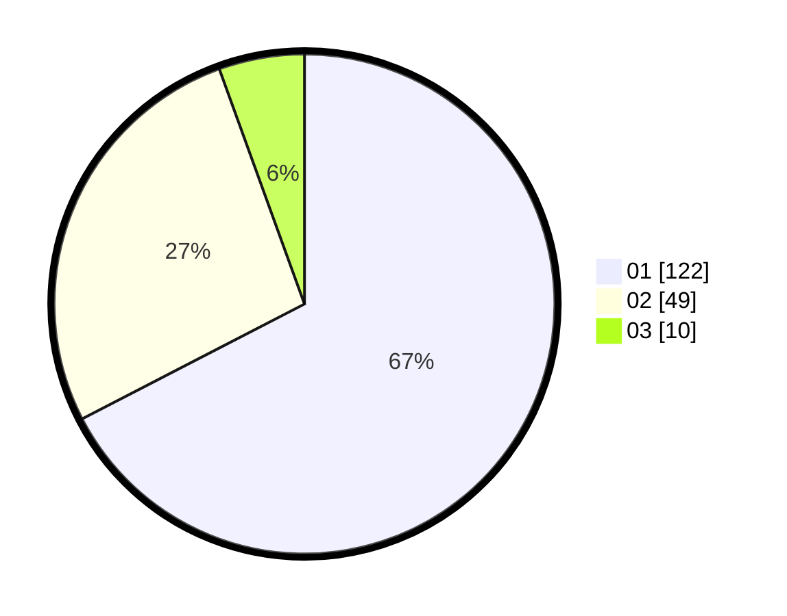

# Hasil

Hasil perolehan suara paslon dapat dilihat pada file paslon-01.txt, paslon-02.txt, dan paslon-03.txt.

Jika tidak ada, artinya data tersebut belum ada pada SIREKAP.

## Perolehan Suara

 * Paslon 01: **122**.
 * Paslon 02: **49**.
 * Paslon 03: **10**.

## Foto C Plano

https://sirekap-obj-formc.kpu.go.id/0a83/pemilu/ppwp/31/71/07/10/04/3171071004010-20240214-155220--849d81cc-8265-4395-b9cd-26cabc55ccdd.jpg

https://sirekap-obj-formc.kpu.go.id/0a83/pemilu/ppwp/31/71/07/10/04/3171071004010-20240214-155328--a5e3b115-3beb-4442-8379-0d33ecc69388.jpg

https://sirekap-obj-formc.kpu.go.id/0a83/pemilu/ppwp/31/71/07/10/04/3171071004010-20240214-155116--e2938151-4140-4f1e-be93-6a1499cf4fa9.jpg

## DATA PEMILIH TETAP

Jumlah pemilih dalam DPT: **272**.
 * L: **137**.
 * P: **135**.

## DATA PENGGUNA HAK PILIH

Jumlah pengguna hak pilih dalam DPT: **179**.
 * L: **85**.
 * P: **94**.

Jumlah pengguna hak pilih dalam DPTb: **0**.
 * L: **0**.
 * P: **0**.

Jumlah pengguna hak pilih dalam DPK: **4**.
 * L: **2**.
 * P: **2**.

Jumlah pengguna hak pilih: **183**.
 * L: **87**.
 * P: **96**.

## JUMLAH SUARA SAH DAN TIDAK SAH

JUMLAH SELURUH SUARA SAH: **181**.

JUMLAH SUARA TIDAK SAH: **3**.

JUMLAH SELURUH SUARA SAH DAN SUARA TIDAK SAH: **184**.
