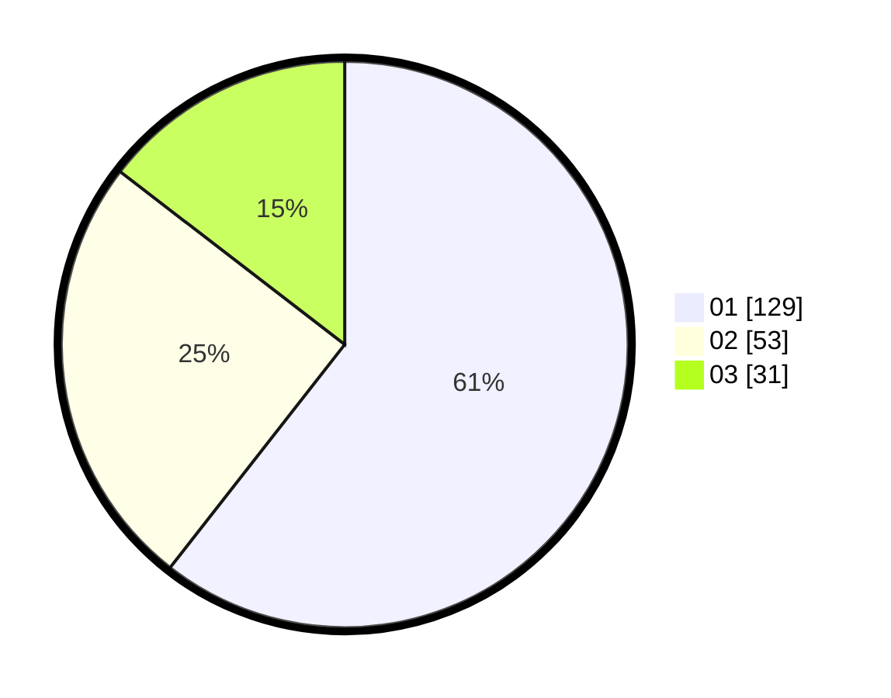

# Hasil

Hasil perolehan suara paslon dapat dilihat pada file paslon-01.txt, paslon-02.txt, dan paslon-03.txt.

Jika tidak ada, artinya data tersebut belum ada pada SIREKAP.

## Perolehan Suara

 * Paslon 01: **129**.
 * Paslon 02: **53**.
 * Paslon 03: **31**.

## Foto C Plano

https://sirekap-obj-formc.kpu.go.id/6869/pemilu/ppwp/31/71/07/10/04/3171071004015-20240216-141141--fd7ebba1-173d-46f2-a43a-88646abb5601.jpg

https://sirekap-obj-formc.kpu.go.id/6869/pemilu/ppwp/31/71/07/10/04/3171071004015-20240216-141143--71073592-5b6b-4424-b98d-3bf7ef697f4c.jpg

https://sirekap-obj-formc.kpu.go.id/6869/pemilu/ppwp/31/71/07/10/04/3171071004015-20240216-141142--fd3cb007-0eba-4302-832e-af9050f02350.jpg

## DATA PEMILIH TETAP

Jumlah pemilih dalam DPT: **280**.
 * L: **144**.
 * P: **136**.

## DATA PENGGUNA HAK PILIH

Jumlah pengguna hak pilih dalam DPT: **210**.
 * L: **111**.
 * P: **99**.

Jumlah pengguna hak pilih dalam DPTb: **6**.
 * L: **3**.
 * P: **3**.

Jumlah pengguna hak pilih dalam DPK: **1**.
 * L: **1**.
 * P: **0**.

Jumlah pengguna hak pilih: **217**.
 * L: **115**.
 * P: **102**.

## JUMLAH SUARA SAH DAN TIDAK SAH

JUMLAH SELURUH SUARA SAH: **213**.

JUMLAH SUARA TIDAK SAH: **4**.

JUMLAH SELURUH SUARA SAH DAN SUARA TIDAK SAH: **217**.
