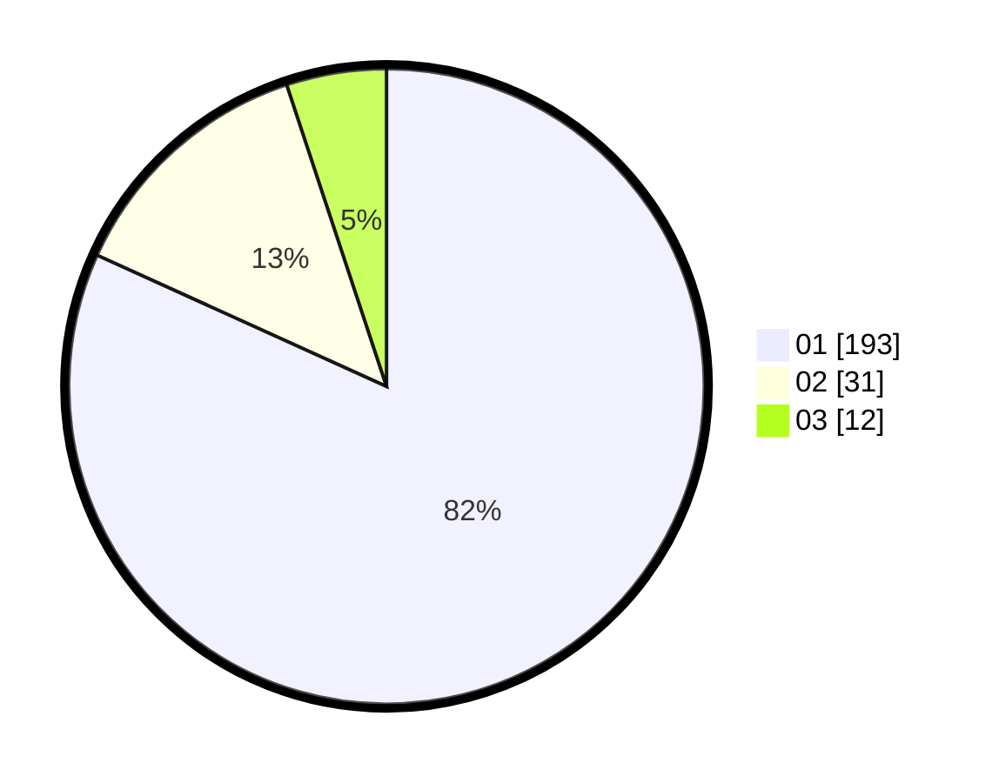

# Hasil

Hasil perolehan suara paslon dapat dilihat pada file paslon-01.txt, paslon-02.txt, dan paslon-03.txt.

Jika tidak ada, artinya data tersebut belum ada pada SIREKAP.

## Perolehan Suara

 * Paslon 01: **193**.
 * Paslon 02: **31**.
 * Paslon 03: **12**.

## Foto C Plano

https://sirekap-obj-formc.kpu.go.id/450f/pemilu/ppwp/31/71/07/10/04/3171071004023-20240214-194930--71ab0ee4-996d-464f-ad36-37314f6cb461.jpg

https://sirekap-obj-formc.kpu.go.id/450f/pemilu/ppwp/31/71/07/10/04/3171071004023-20240214-195013--5b882355-8f8f-478e-93f3-d397fa8c8795.jpg

https://sirekap-obj-formc.kpu.go.id/450f/pemilu/ppwp/31/71/07/10/04/3171071004023-20240214-195016--19d293c1-1ea4-4e34-81d9-b90e27a7d30e.jpg

## DATA PEMILIH TETAP

Jumlah pemilih dalam DPT: **282**.
 * L: **138**.
 * P: **144**.

## DATA PENGGUNA HAK PILIH

Jumlah pengguna hak pilih dalam DPT: **234**.
 * L: **112**.
 * P: **122**.

Jumlah pengguna hak pilih dalam DPTb: **2**.
 * L: **2**.
 * P: **0**.

Jumlah pengguna hak pilih dalam DPK: **3**.
 * L: **1**.
 * P: **2**.

Jumlah pengguna hak pilih: **239**.
 * L: **115**.
 * P: **124**.

## JUMLAH SUARA SAH DAN TIDAK SAH

JUMLAH SELURUH SUARA SAH: **236**.

JUMLAH SUARA TIDAK SAH: **3**.

JUMLAH SELURUH SUARA SAH DAN SUARA TIDAK SAH: **239**.
