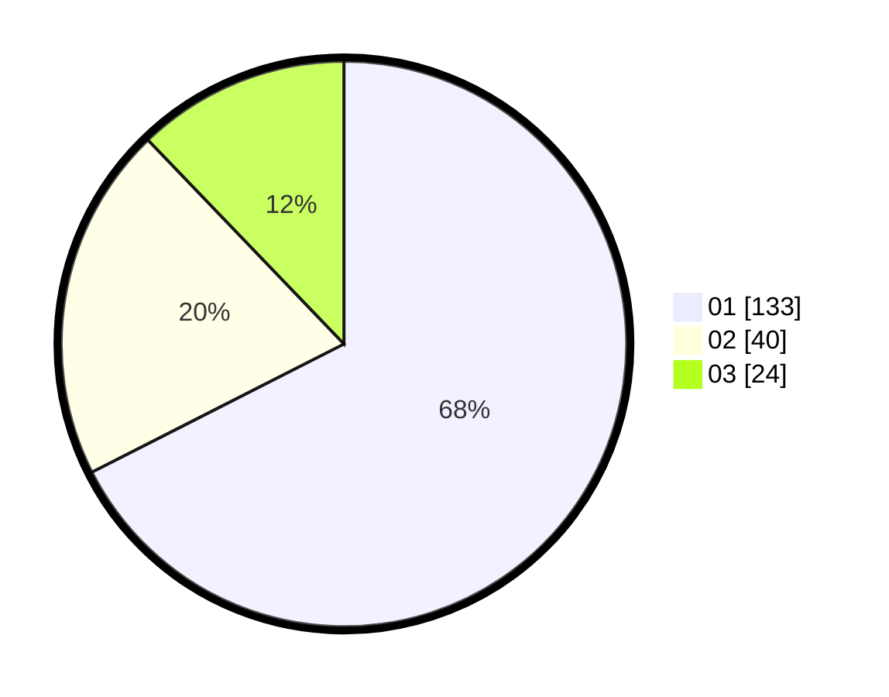

# Hasil

Hasil perolehan suara paslon dapat dilihat pada file paslon-01.txt, paslon-02.txt, dan paslon-03.txt.

Jika tidak ada, artinya data tersebut belum ada pada SIREKAP.

## Perolehan Suara

 * Paslon 01: **133**.
 * Paslon 02: **40**.
 * Paslon 03: **24**.

## Foto C Plano

https://sirekap-obj-formc.kpu.go.id/344d/pemilu/ppwp/31/71/07/10/04/3171071004026-20240214-203226--94cc902a-cfcd-4688-9dee-0ad3d72eb259.jpg

https://sirekap-obj-formc.kpu.go.id/344d/pemilu/ppwp/31/71/07/10/04/3171071004026-20240214-203354--e553289e-c6bb-4fe3-a300-a1d48997219e.jpg

https://sirekap-obj-formc.kpu.go.id/344d/pemilu/ppwp/31/71/07/10/04/3171071004026-20240214-230411--0e85ce16-01f0-43e6-9040-e1d9478782fd.jpg

## DATA PEMILIH TETAP

Jumlah pemilih dalam DPT: **262**.
 * L: **128**.
 * P: **134**.

## DATA PENGGUNA HAK PILIH

Jumlah pengguna hak pilih dalam DPT: **198**.
 * L: **96**.
 * P: **102**.

Jumlah pengguna hak pilih dalam DPTb: **0**.
 * L: **0**.
 * P: **0**.

Jumlah pengguna hak pilih dalam DPK: **2**.
 * L: **1**.
 * P: **1**.

Jumlah pengguna hak pilih: **200**.
 * L: **97**.
 * P: **103**.

## JUMLAH SUARA SAH DAN TIDAK SAH

JUMLAH SELURUH SUARA SAH: **197**.

JUMLAH SUARA TIDAK SAH: **3**.

JUMLAH SELURUH SUARA SAH DAN SUARA TIDAK SAH: **200**.
