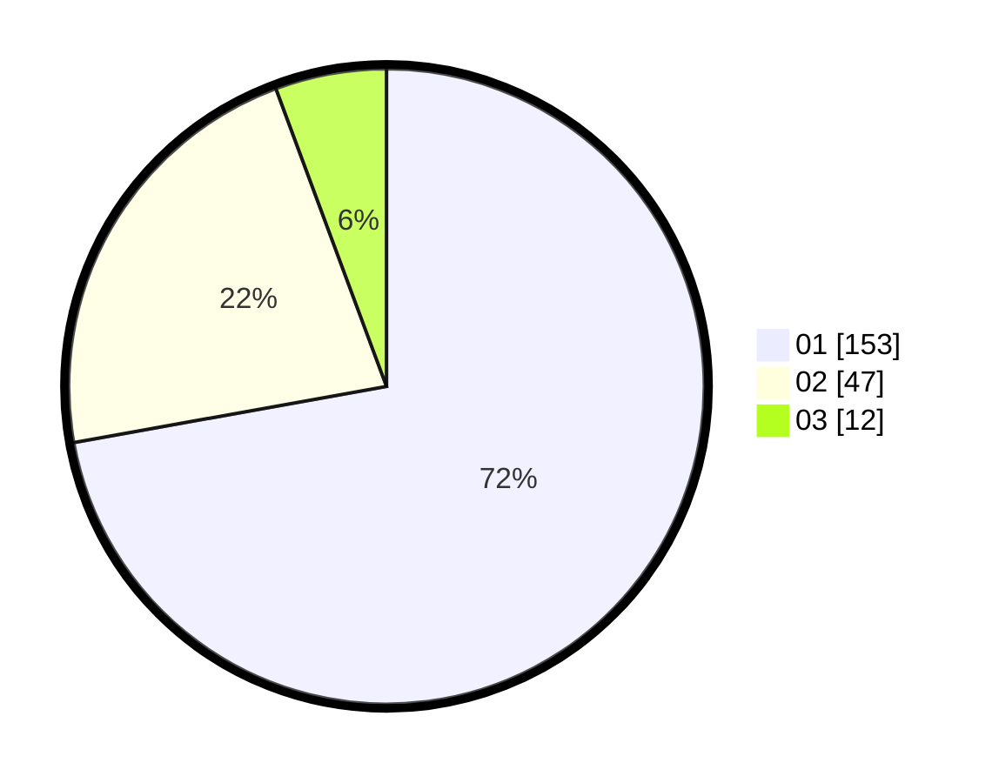

# Hasil

Hasil perolehan suara paslon dapat dilihat pada file paslon-01.txt, paslon-02.txt, dan paslon-03.txt.

Jika tidak ada, artinya data tersebut belum ada pada SIREKAP.

## Perolehan Suara

 * Paslon 01: **153**.
 * Paslon 02: **47**.
 * Paslon 03: **12**.

## Foto C Plano

https://sirekap-obj-formc.kpu.go.id/6b6c/pemilu/ppwp/31/71/07/10/04/3171071004043-20240215-002244--0e69e5a4-1f8b-4800-affb-36e06f31c22a.jpg

https://sirekap-obj-formc.kpu.go.id/6b6c/pemilu/ppwp/31/71/07/10/04/3171071004043-20240215-002601--9be961f7-8241-4100-9ea8-63693f5928b5.jpg

https://sirekap-obj-formc.kpu.go.id/6b6c/pemilu/ppwp/31/71/07/10/04/3171071004043-20240215-002715--95b4e086-1377-4942-8004-29aa86b1641a.jpg

## DATA PEMILIH TETAP

Jumlah pemilih dalam DPT: **269**.
 * L: **136**.
 * P: **133**.

## DATA PENGGUNA HAK PILIH

Jumlah pengguna hak pilih dalam DPT: **212**.
 * L: **105**.
 * P: **107**.

Jumlah pengguna hak pilih dalam DPTb: **0**.
 * L: **0**.
 * P: **0**.

Jumlah pengguna hak pilih dalam DPK: **1**.
 * L: **1**.
 * P: **0**.

Jumlah pengguna hak pilih: **213**.
 * L: **106**.
 * P: **107**.

## JUMLAH SUARA SAH DAN TIDAK SAH

JUMLAH SELURUH SUARA SAH: **212**.

JUMLAH SUARA TIDAK SAH: **1**.

JUMLAH SELURUH SUARA SAH DAN SUARA TIDAK SAH: **213**.
