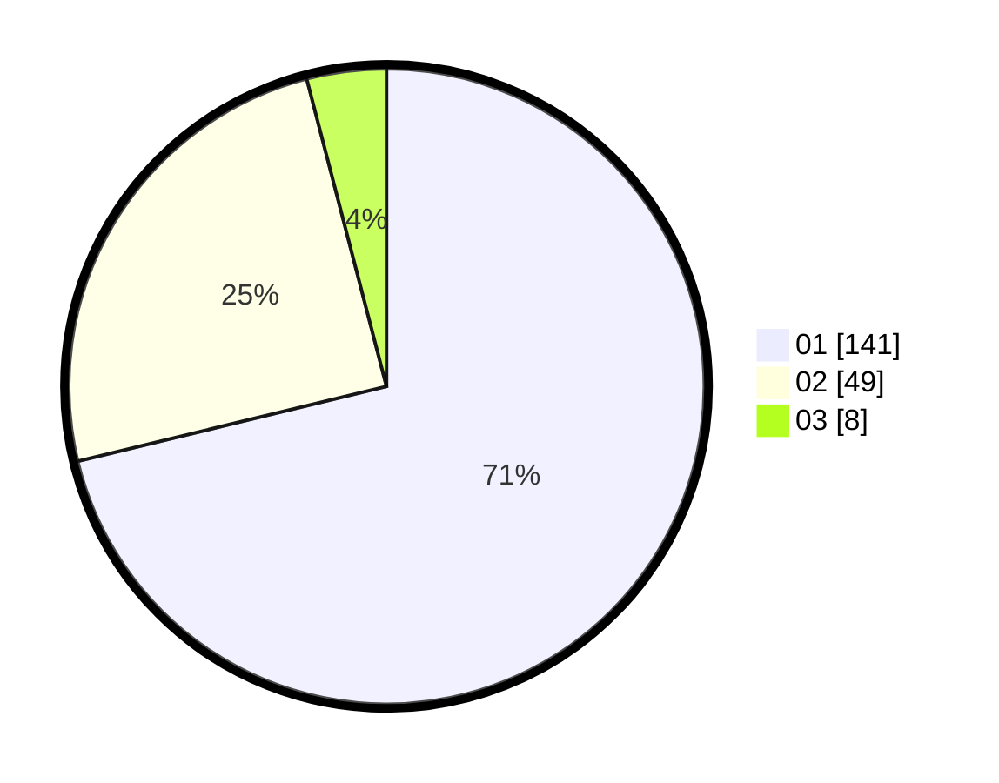

# Hasil

Hasil perolehan suara paslon dapat dilihat pada file paslon-01.txt, paslon-02.txt, dan paslon-03.txt.

Jika tidak ada, artinya data tersebut belum ada pada SIREKAP.

## Perolehan Suara

 * Paslon 01: **141**.
 * Paslon 02: **49**.
 * Paslon 03: **8**.

## Foto C Plano

https://sirekap-obj-formc.kpu.go.id/56ac/pemilu/ppwp/31/71/07/10/04/3171071004049-20240216-142028--a5ee7623-da43-4ae3-94ba-ff27416fd2b0.jpg

https://sirekap-obj-formc.kpu.go.id/56ac/pemilu/ppwp/31/71/07/10/04/3171071004049-20240216-142029--955157a3-5c7b-487a-836f-679d82a12b5a.jpg

https://sirekap-obj-formc.kpu.go.id/56ac/pemilu/ppwp/31/71/07/10/04/3171071004049-20240216-142028--2779f28f-2507-40cc-8bd9-9af3d75fe66f.jpg

## DATA PEMILIH TETAP

Jumlah pemilih dalam DPT: **255**.
 * L: **124**.
 * P: **131**.

## DATA PENGGUNA HAK PILIH

Jumlah pengguna hak pilih dalam DPT: **194**.
 * L: **86**.
 * P: **108**.

Jumlah pengguna hak pilih dalam DPTb: **3**.
 * L: **0**.
 * P: **3**.

Jumlah pengguna hak pilih dalam DPK: **3**.
 * L: **2**.
 * P: **1**.

Jumlah pengguna hak pilih: **200**.
 * L: **88**.
 * P: **112**.

## JUMLAH SUARA SAH DAN TIDAK SAH

JUMLAH SELURUH SUARA SAH: **198**.

JUMLAH SUARA TIDAK SAH: **2**.

JUMLAH SELURUH SUARA SAH DAN SUARA TIDAK SAH: **200**.
