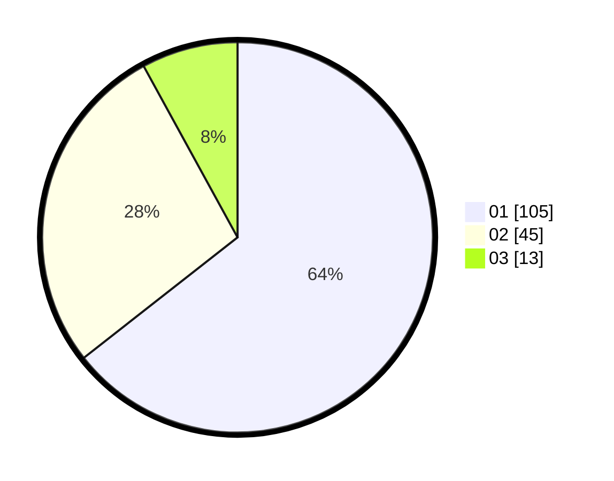

# Hasil

Hasil perolehan suara paslon dapat dilihat pada file paslon-01.txt, paslon-02.txt, dan paslon-03.txt.

Jika tidak ada, artinya data tersebut belum ada pada SIREKAP.

## Perolehan Suara

 * Paslon 01: **105**.
 * Paslon 02: **45**.
 * Paslon 03: **13**.

## Foto C Plano

https://sirekap-obj-formc.kpu.go.id/4367/pemilu/ppwp/31/71/07/10/04/3171071004050-20240216-070111--1404b9cf-613f-4399-ab30-0f05e2e77f5f.jpg

https://sirekap-obj-formc.kpu.go.id/4367/pemilu/ppwp/31/71/07/10/04/3171071004050-20240216-070115--ccc5e5b9-6e76-4b32-961b-a21a32de4367.jpg

https://sirekap-obj-formc.kpu.go.id/4367/pemilu/ppwp/31/71/07/10/04/3171071004050-20240216-070112--487855f7-15cc-41e7-988c-50d5e4d44b9e.jpg

## DATA PEMILIH TETAP

Jumlah pemilih dalam DPT: **276**.
 * L: **138**.
 * P: **138**.

## DATA PENGGUNA HAK PILIH

Jumlah pengguna hak pilih dalam DPT: **161**.
 * L: **74**.
 * P: **87**.

Jumlah pengguna hak pilih dalam DPTb: **4**.
 * L: **1**.
 * P: **3**.

Jumlah pengguna hak pilih dalam DPK: **0**.
 * L: **0**.
 * P: **0**.

Jumlah pengguna hak pilih: **165**.
 * L: **75**.
 * P: **90**.

## JUMLAH SUARA SAH DAN TIDAK SAH

JUMLAH SELURUH SUARA SAH: **163**.

JUMLAH SUARA TIDAK SAH: **2**.

JUMLAH SELURUH SUARA SAH DAN SUARA TIDAK SAH: **165**.
