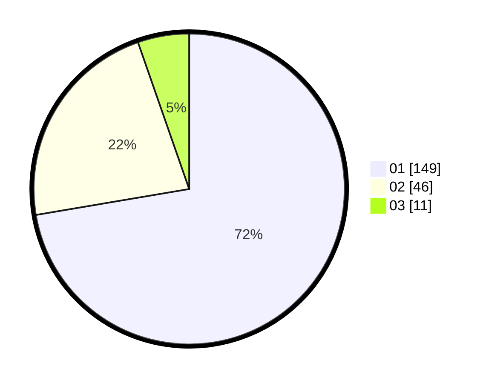

# Hasil

Hasil perolehan suara paslon dapat dilihat pada file paslon-01.txt, paslon-02.txt, dan paslon-03.txt.

Jika tidak ada, artinya data tersebut belum ada pada SIREKAP.

## Perolehan Suara

 * Paslon 01: **149**.
 * Paslon 02: **46**.
 * Paslon 03: **11**.

## Foto C Plano

https://sirekap-obj-formc.kpu.go.id/adb0/pemilu/ppwp/31/71/07/10/04/3171071004051-20240216-152554--973446ef-b674-4131-90ec-c51608653b11.jpg

https://sirekap-obj-formc.kpu.go.id/adb0/pemilu/ppwp/31/71/07/10/04/3171071004051-20240216-152555--c5090c2d-0fc7-4247-99c9-ef1bdf57f568.jpg

https://sirekap-obj-formc.kpu.go.id/adb0/pemilu/ppwp/31/71/07/10/04/3171071004051-20240216-152554--a74b35ea-f379-46f2-863f-136340402fbc.jpg

## DATA PEMILIH TETAP

Jumlah pemilih dalam DPT: **272**.
 * L: **142**.
 * P: **130**.

## DATA PENGGUNA HAK PILIH

Jumlah pengguna hak pilih dalam DPT: **205**.
 * L: **105**.
 * P: **100**.

Jumlah pengguna hak pilih dalam DPTb: **2**.
 * L: **1**.
 * P: **1**.

Jumlah pengguna hak pilih dalam DPK: **1**.
 * L: **1**.
 * P: **0**.

Jumlah pengguna hak pilih: **208**.
 * L: **107**.
 * P: **101**.

## JUMLAH SUARA SAH DAN TIDAK SAH

JUMLAH SELURUH SUARA SAH: **206**.

JUMLAH SUARA TIDAK SAH: **2**.

JUMLAH SELURUH SUARA SAH DAN SUARA TIDAK SAH: **208**.
