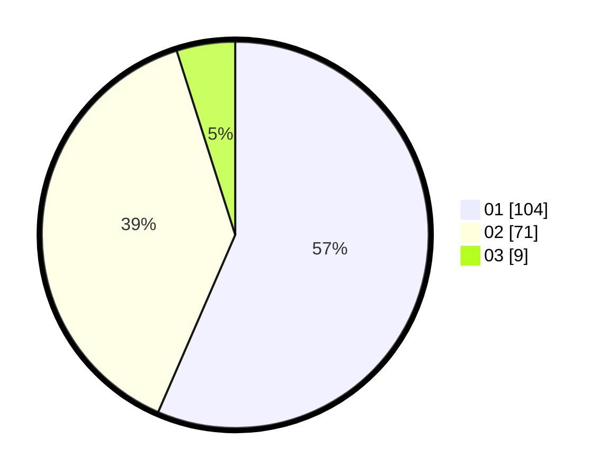

# Hasil

Hasil perolehan suara paslon dapat dilihat pada file paslon-01.txt, paslon-02.txt, dan paslon-03.txt.

Jika tidak ada, artinya data tersebut belum ada pada SIREKAP.

## Perolehan Suara

 * Paslon 01: **104**.
 * Paslon 02: **71**.
 * Paslon 03: **9**.

## Foto C Plano

https://sirekap-obj-formc.kpu.go.id/eacd/pemilu/ppwp/31/71/07/10/04/3171071004062-20240214-201851--8497075e-7d09-4785-a32d-2e677c171489.jpg

https://sirekap-obj-formc.kpu.go.id/eacd/pemilu/ppwp/31/71/07/10/04/3171071004062-20240214-202020--e921f61d-200a-43f6-849d-0e892fbd0aed.jpg

https://sirekap-obj-formc.kpu.go.id/eacd/pemilu/ppwp/31/71/07/10/04/3171071004062-20240214-202121--1b256714-9cde-46bc-8436-aa507325d75a.jpg

## DATA PEMILIH TETAP

Jumlah pemilih dalam DPT: **277**.
 * L: **135**.
 * P: **142**.

## DATA PENGGUNA HAK PILIH

Jumlah pengguna hak pilih dalam DPT: **180**.
 * L: **89**.
 * P: **91**.

Jumlah pengguna hak pilih dalam DPTb: **5**.
 * L: **0**.
 * P: **5**.

Jumlah pengguna hak pilih dalam DPK: **2**.
 * L: **1**.
 * P: **1**.

Jumlah pengguna hak pilih: **187**.
 * L: **90**.
 * P: **97**.

## JUMLAH SUARA SAH DAN TIDAK SAH

JUMLAH SELURUH SUARA SAH: **184**.

JUMLAH SUARA TIDAK SAH: **3**.

JUMLAH SELURUH SUARA SAH DAN SUARA TIDAK SAH: **187**.
