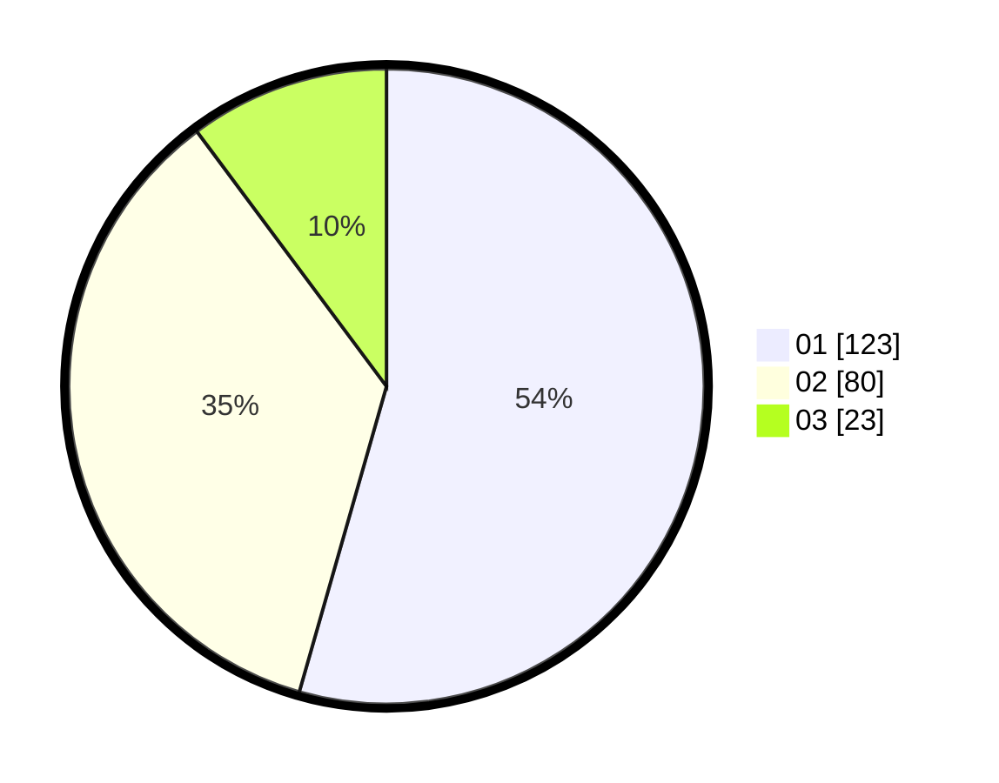

# Hasil

Hasil perolehan suara paslon dapat dilihat pada file paslon-01.txt, paslon-02.txt, dan paslon-03.txt.

Jika tidak ada, artinya data tersebut belum ada pada SIREKAP.

## Perolehan Suara

 * Paslon 01: **123**.
 * Paslon 02: **80**.
 * Paslon 03: **23**.

## Foto C Plano

https://sirekap-obj-formc.kpu.go.id/8ed5/pemilu/ppwp/31/71/07/10/04/3171071004070-20240215-012322--fd029580-89e9-4015-8a74-d56fb367b8e7.jpg

https://sirekap-obj-formc.kpu.go.id/8ed5/pemilu/ppwp/31/71/07/10/04/3171071004070-20240215-013643--8e76a43e-5cba-41df-934c-c2b674286f7a.jpg

https://sirekap-obj-formc.kpu.go.id/8ed5/pemilu/ppwp/31/71/07/10/04/3171071004070-20240215-013748--ffb2316d-ded9-4be7-b7f7-56a2d60ccb55.jpg

## DATA PEMILIH TETAP

Jumlah pemilih dalam DPT: **271**.
 * L: **133**.
 * P: **138**.

## DATA PENGGUNA HAK PILIH

Jumlah pengguna hak pilih dalam DPT: **222**.
 * L: **109**.
 * P: **113**.

Jumlah pengguna hak pilih dalam DPTb: **7**.
 * L: **4**.
 * P: **3**.

Jumlah pengguna hak pilih dalam DPK: **0**.
 * L: **0**.
 * P: **0**.

Jumlah pengguna hak pilih: **229**.
 * L: **113**.
 * P: **116**.

## JUMLAH SUARA SAH DAN TIDAK SAH

JUMLAH SELURUH SUARA SAH: **226**.

JUMLAH SUARA TIDAK SAH: **3**.

JUMLAH SELURUH SUARA SAH DAN SUARA TIDAK SAH: **229**.
