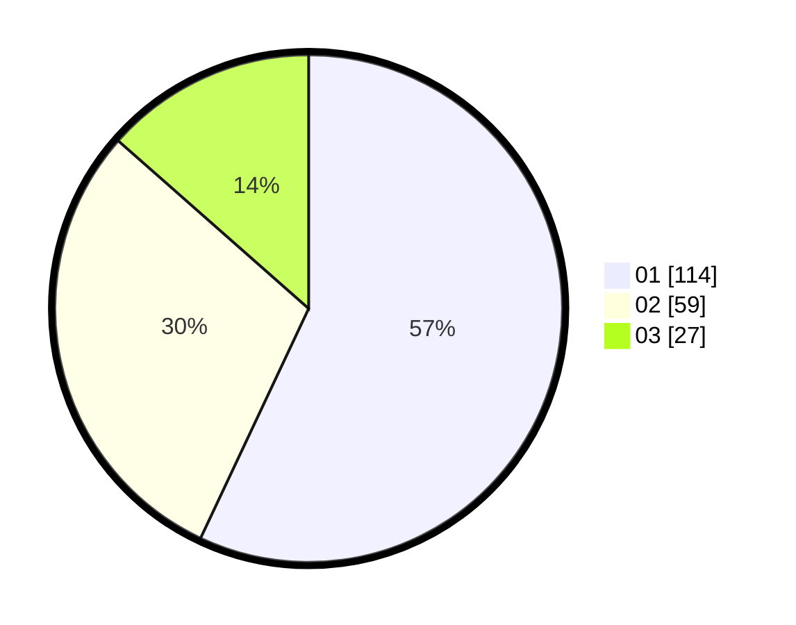

# Hasil

Hasil perolehan suara paslon dapat dilihat pada file paslon-01.txt, paslon-02.txt, dan paslon-03.txt.

Jika tidak ada, artinya data tersebut belum ada pada SIREKAP.

## Perolehan Suara

 * Paslon 01: **114**.
 * Paslon 02: **59**.
 * Paslon 03: **27**.

## Foto C Plano

https://sirekap-obj-formc.kpu.go.id/02fc/pemilu/ppwp/31/71/07/10/04/3171071004076-20240214-201811--9826b905-c167-4210-bea8-dceb22a0bcf3.jpg

https://sirekap-obj-formc.kpu.go.id/02fc/pemilu/ppwp/31/71/07/10/04/3171071004076-20240214-201938--0e63829b-fedb-4ec4-8c80-02a6a8fed597.jpg

https://sirekap-obj-formc.kpu.go.id/02fc/pemilu/ppwp/31/71/07/10/04/3171071004076-20240214-202412--71c31d41-602c-4240-971c-dac24984cbba.jpg

## DATA PEMILIH TETAP

Jumlah pemilih dalam DPT: **255**.
 * L: **120**.
 * P: **135**.

## DATA PENGGUNA HAK PILIH

Jumlah pengguna hak pilih dalam DPT: **202**.
 * L: **94**.
 * P: **108**.

Jumlah pengguna hak pilih dalam DPTb: **0**.
 * L: **0**.
 * P: **0**.

Jumlah pengguna hak pilih dalam DPK: **2**.
 * L: **2**.
 * P: **0**.

Jumlah pengguna hak pilih: **204**.
 * L: **96**.
 * P: **108**.

## JUMLAH SUARA SAH DAN TIDAK SAH

JUMLAH SELURUH SUARA SAH: **200**.

JUMLAH SUARA TIDAK SAH: **4**.

JUMLAH SELURUH SUARA SAH DAN SUARA TIDAK SAH: **204**.
