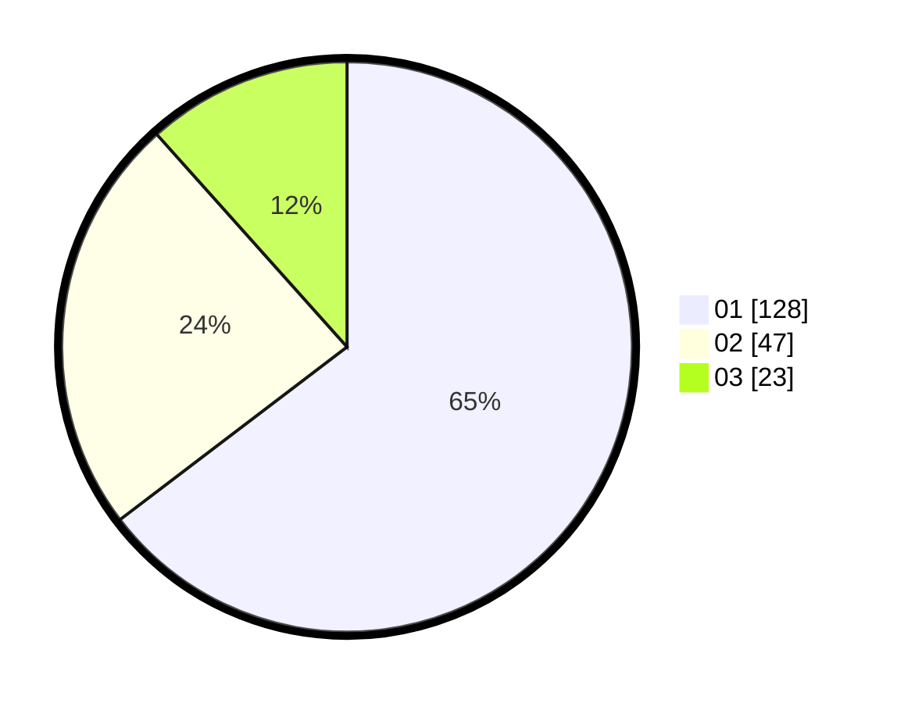

# Hasil

Hasil perolehan suara paslon dapat dilihat pada file paslon-01.txt, paslon-02.txt, dan paslon-03.txt.

Jika tidak ada, artinya data tersebut belum ada pada SIREKAP.

## Perolehan Suara

 * Paslon 01: **128**.
 * Paslon 02: **47**.
 * Paslon 03: **23**.

## Foto C Plano

https://sirekap-obj-formc.kpu.go.id/48fd/pemilu/ppwp/31/71/07/10/04/3171071004078-20240218-104946--f637d049-d5f3-44de-8dee-2cd429e29dec.jpg

https://sirekap-obj-formc.kpu.go.id/48fd/pemilu/ppwp/31/71/07/10/04/3171071004078-20240218-104948--7cce1166-0a45-477a-8497-c4d148bfd74a.jpg

https://sirekap-obj-formc.kpu.go.id/48fd/pemilu/ppwp/31/71/07/10/04/3171071004078-20240218-104947--eed6ed8c-1866-473e-aedf-2607bba3ae94.jpg

## DATA PEMILIH TETAP

Jumlah pemilih dalam DPT: **264**.
 * L: **134**.
 * P: **130**.

## DATA PENGGUNA HAK PILIH

Jumlah pengguna hak pilih dalam DPT: **189**.
 * L: **95**.
 * P: **94**.

Jumlah pengguna hak pilih dalam DPTb: **9**.
 * L: **1**.
 * P: **8**.

Jumlah pengguna hak pilih dalam DPK: **7**.
 * L: **3**.
 * P: **4**.

Jumlah pengguna hak pilih: **205**.
 * L: **99**.
 * P: **106**.

## JUMLAH SUARA SAH DAN TIDAK SAH

JUMLAH SELURUH SUARA SAH: **198**.

JUMLAH SUARA TIDAK SAH: **7**.

JUMLAH SELURUH SUARA SAH DAN SUARA TIDAK SAH: **205**.
