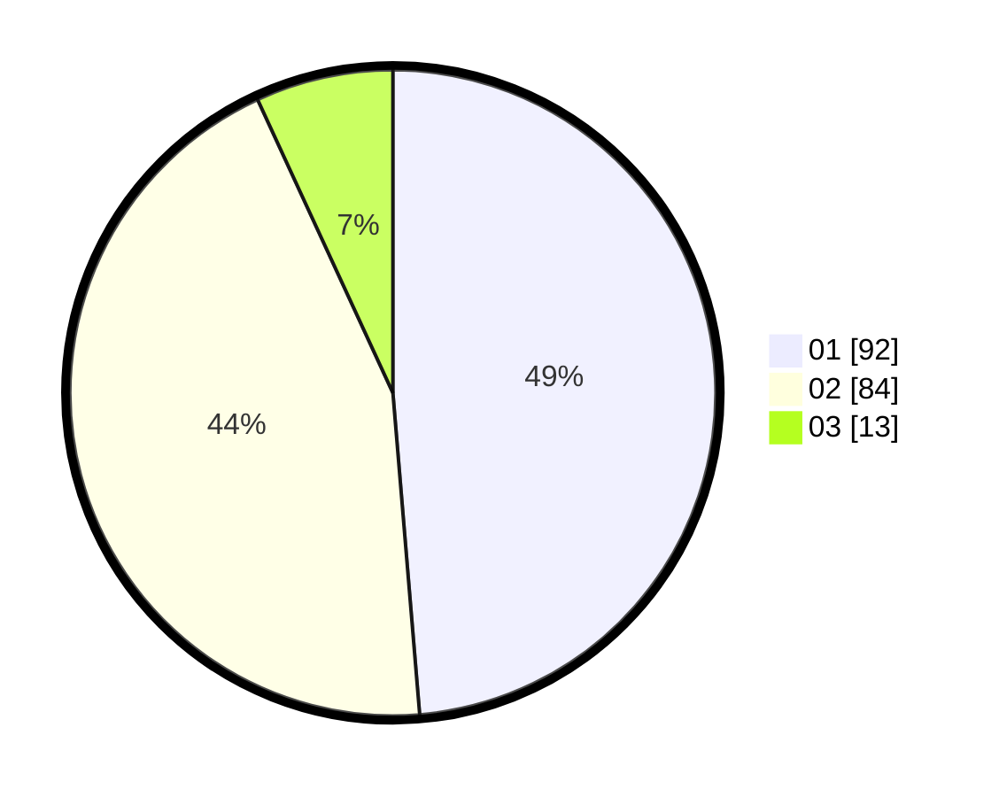

# Hasil

Hasil perolehan suara paslon dapat dilihat pada file paslon-01.txt, paslon-02.txt, dan paslon-03.txt.

Jika tidak ada, artinya data tersebut belum ada pada SIREKAP.

## Perolehan Suara

 * Paslon 01: **92**.
 * Paslon 02: **84**.
 * Paslon 03: **13**.

## Foto C Plano

https://sirekap-obj-formc.kpu.go.id/8313/pemilu/ppwp/31/71/07/10/04/3171071004094-20240218-030125--aa618412-3487-4ea4-b6ff-97d14c97973b.jpg

https://sirekap-obj-formc.kpu.go.id/8313/pemilu/ppwp/31/71/07/10/04/3171071004094-20240218-030126--e53aa3db-627e-4811-8b67-6666301bb5ed.jpg

https://sirekap-obj-formc.kpu.go.id/8313/pemilu/ppwp/31/71/07/10/04/3171071004094-20240218-030126--8adde482-66fc-4451-88e7-dc6e2194c41c.jpg

## DATA PEMILIH TETAP

Jumlah pemilih dalam DPT: **230**.
 * L: **123**.
 * P: **107**.

## DATA PENGGUNA HAK PILIH

Jumlah pengguna hak pilih dalam DPT: **188**.
 * L: **96**.
 * P: **92**.

Jumlah pengguna hak pilih dalam DPTb: **0**.
 * L: **0**.
 * P: **0**.

Jumlah pengguna hak pilih dalam DPK: **2**.
 * L: **0**.
 * P: **2**.

Jumlah pengguna hak pilih: **190**.
 * L: **96**.
 * P: **94**.

## JUMLAH SUARA SAH DAN TIDAK SAH

JUMLAH SELURUH SUARA SAH: **189**.

JUMLAH SUARA TIDAK SAH: **1**.

JUMLAH SELURUH SUARA SAH DAN SUARA TIDAK SAH: **190**.
