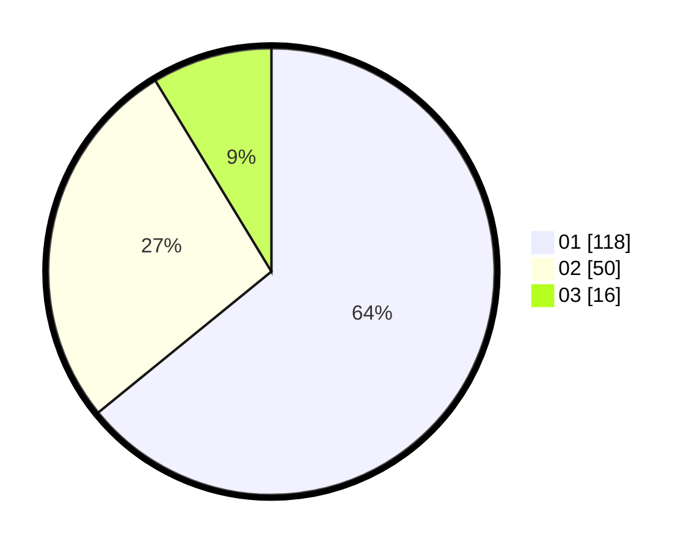

# Hasil

Hasil perolehan suara paslon dapat dilihat pada file paslon-01.txt, paslon-02.txt, dan paslon-03.txt.

Jika tidak ada, artinya data tersebut belum ada pada SIREKAP.

## Perolehan Suara

 * Paslon 01: **118**.
 * Paslon 02: **50**.
 * Paslon 03: **16**.

## Foto C Plano

https://sirekap-obj-formc.kpu.go.id/83b7/pemilu/ppwp/31/71/07/10/04/3171071004098-20240214-192234--6629fd66-22f8-4f1c-9585-0ea55d9660f5.jpg

https://sirekap-obj-formc.kpu.go.id/83b7/pemilu/ppwp/31/71/07/10/04/3171071004098-20240214-192414--c1826b60-a407-4518-bafb-612c32be8086.jpg

https://sirekap-obj-formc.kpu.go.id/83b7/pemilu/ppwp/31/71/07/10/04/3171071004098-20240214-192633--2e204c2f-b87c-4b12-a10b-721f9a124471.jpg
