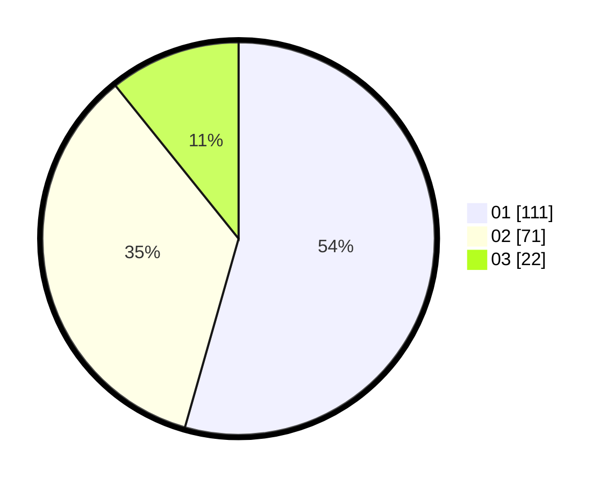

# Hasil

Hasil perolehan suara paslon dapat dilihat pada file paslon-01.txt, paslon-02.txt, dan paslon-03.txt.

Jika tidak ada, artinya data tersebut belum ada pada SIREKAP.

## Perolehan Suara

 * Paslon 01: **111**.
 * Paslon 02: **71**.
 * Paslon 03: **22**.

## Foto C Plano

https://sirekap-obj-formc.kpu.go.id/90c5/pemilu/ppwp/31/71/07/10/04/3171071004101-20240215-055836--83cd816a-4fcf-4f1f-8e16-d45aa42e69fc.jpg

https://sirekap-obj-formc.kpu.go.id/90c5/pemilu/ppwp/31/71/07/10/04/3171071004101-20240215-060454--721932ec-48af-4657-bb64-5dfcd1009a91.jpg

https://sirekap-obj-formc.kpu.go.id/90c5/pemilu/ppwp/31/71/07/10/04/3171071004101-20240215-055956--9432e0a7-e0ab-4939-a881-ffc2539f434e.jpg

## DATA PEMILIH TETAP

Jumlah pemilih dalam DPT: **266**.
 * L: **129**.
 * P: **137**.

## DATA PENGGUNA HAK PILIH

Jumlah pengguna hak pilih dalam DPT: **205**.
 * L: **93**.
 * P: **112**.

Jumlah pengguna hak pilih dalam DPTb: **0**.
 * L: **0**.
 * P: **0**.

Jumlah pengguna hak pilih dalam DPK: **3**.
 * L: **2**.
 * P: **1**.

Jumlah pengguna hak pilih: **208**.
 * L: **95**.
 * P: **113**.

## JUMLAH SUARA SAH DAN TIDAK SAH

JUMLAH SELURUH SUARA SAH: **204**.

JUMLAH SUARA TIDAK SAH: **4**.

JUMLAH SELURUH SUARA SAH DAN SUARA TIDAK SAH: **208**.
