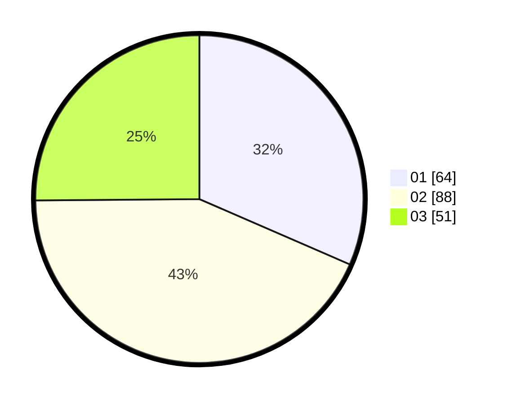

# Hasil

Hasil perolehan suara paslon dapat dilihat pada file paslon-01.txt, paslon-02.txt, dan paslon-03.txt.

Jika tidak ada, artinya data tersebut belum ada pada SIREKAP.

## Perolehan Suara

 * Paslon 01: **64**.
 * Paslon 02: **88**.
 * Paslon 03: **51**.

## Foto C Plano

https://sirekap-obj-formc.kpu.go.id/e008/pemilu/ppwp/31/71/07/10/04/3171071004105-20240215-221249--7a774d76-8fc7-45da-b695-422ee030764c.jpg

https://sirekap-obj-formc.kpu.go.id/e008/pemilu/ppwp/31/71/07/10/04/3171071004105-20240215-221253--43ae0cb8-19e9-4589-9382-d853c54307d9.jpg

https://sirekap-obj-formc.kpu.go.id/e008/pemilu/ppwp/31/71/07/10/04/3171071004105-20240215-221250--c28f399c-f8a8-4608-aaa4-12e3d5821c42.jpg

## DATA PEMILIH TETAP

Jumlah pemilih dalam DPT: **205**.
 * L: **103**.
 * P: **102**.

## DATA PENGGUNA HAK PILIH

Jumlah pengguna hak pilih dalam DPT: **205**.
 * L: **103**.
 * P: **102**.

Jumlah pengguna hak pilih dalam DPTb: **0**.
 * L: **0**.
 * P: **0**.

Jumlah pengguna hak pilih dalam DPK: **1**.
 * L: **1**.
 * P: **0**.

Jumlah pengguna hak pilih: **206**.
 * L: **104**.
 * P: **102**.

## JUMLAH SUARA SAH DAN TIDAK SAH

JUMLAH SELURUH SUARA SAH: **203**.

JUMLAH SUARA TIDAK SAH: **3**.

JUMLAH SELURUH SUARA SAH DAN SUARA TIDAK SAH: **206**.
