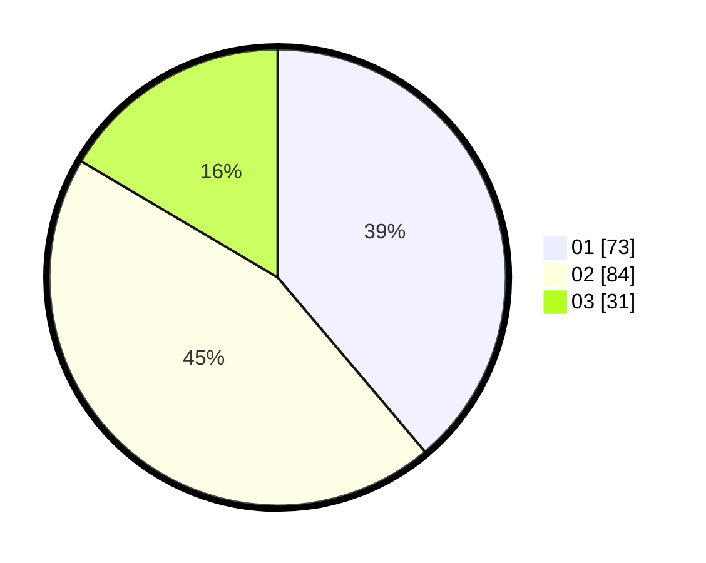

# Hasil

Hasil perolehan suara paslon dapat dilihat pada file paslon-01.txt, paslon-02.txt, dan paslon-03.txt.

Jika tidak ada, artinya data tersebut belum ada pada SIREKAP.

## Perolehan Suara

 * Paslon 01: **73**.
 * Paslon 02: **84**.
 * Paslon 03: **31**.

## Foto C Plano

https://sirekap-obj-formc.kpu.go.id/dfe9/pemilu/ppwp/31/71/07/10/04/3171071004110-20240215-010716--efc8e731-966f-4e30-948c-65e092ed5ccf.jpg

https://sirekap-obj-formc.kpu.go.id/dfe9/pemilu/ppwp/31/71/07/10/04/3171071004110-20240215-010927--816acf17-d596-40b0-877a-e8d0064f774a.jpg

https://sirekap-obj-formc.kpu.go.id/dfe9/pemilu/ppwp/31/71/07/10/04/3171071004110-20240215-011036--bedbf7e1-3988-48bf-bef7-fa28c4c8d8b8.jpg

## DATA PEMILIH TETAP

Jumlah pemilih dalam DPT: **248**.
 * L: **109**.
 * P: **139**.

## DATA PENGGUNA HAK PILIH

Jumlah pengguna hak pilih dalam DPT: **187**.
 * L: **86**.
 * P: **101**.

Jumlah pengguna hak pilih dalam DPTb: **1**.
 * L: **1**.
 * P: **0**.

Jumlah pengguna hak pilih dalam DPK: **2**.
 * L: **0**.
 * P: **2**.

Jumlah pengguna hak pilih: **190**.
 * L: **87**.
 * P: **103**.

## JUMLAH SUARA SAH DAN TIDAK SAH

JUMLAH SELURUH SUARA SAH: **188**.

JUMLAH SUARA TIDAK SAH: **2**.

JUMLAH SELURUH SUARA SAH DAN SUARA TIDAK SAH: **190**.
