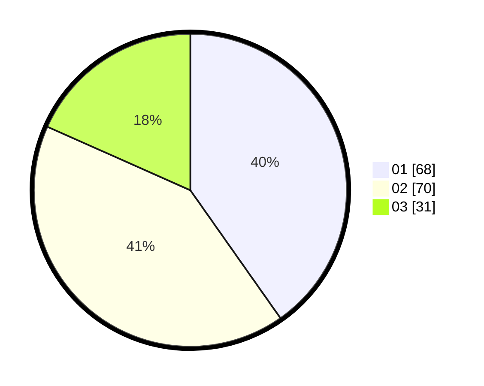

# Hasil

Hasil perolehan suara paslon dapat dilihat pada file paslon-01.txt, paslon-02.txt, dan paslon-03.txt.

Jika tidak ada, artinya data tersebut belum ada pada SIREKAP.

## Perolehan Suara

 * Paslon 01: **68**.
 * Paslon 02: **70**.
 * Paslon 03: **31**.

## Foto C Plano

https://sirekap-obj-formc.kpu.go.id/95eb/pemilu/ppwp/31/71/07/10/05/3171071005006-20240214-212036--4982a0c9-2000-4b47-8dbe-4fb229bfd91f.jpg

https://sirekap-obj-formc.kpu.go.id/95eb/pemilu/ppwp/31/71/07/10/05/3171071005006-20240214-212157--71bc8315-f4ab-40cb-bcd8-80f398b98f87.jpg

https://sirekap-obj-formc.kpu.go.id/95eb/pemilu/ppwp/31/71/07/10/05/3171071005006-20240214-193948--45f15877-da8f-4dc4-ab03-eb181554b7f2.jpg

## DATA PEMILIH TETAP

Jumlah pemilih dalam DPT: **286**.
 * L: **154**.
 * P: **132**.

## DATA PENGGUNA HAK PILIH

Jumlah pengguna hak pilih dalam DPT: **165**.
 * L: **83**.
 * P: **82**.

Jumlah pengguna hak pilih dalam DPTb: **0**.
 * L: **0**.
 * P: **0**.

Jumlah pengguna hak pilih dalam DPK: **5**.
 * L: **2**.
 * P: **3**.

Jumlah pengguna hak pilih: **170**.
 * L: **85**.
 * P: **85**.

## JUMLAH SUARA SAH DAN TIDAK SAH

JUMLAH SELURUH SUARA SAH: **170**.

JUMLAH SUARA TIDAK SAH: **0**.

JUMLAH SELURUH SUARA SAH DAN SUARA TIDAK SAH: **170**.
