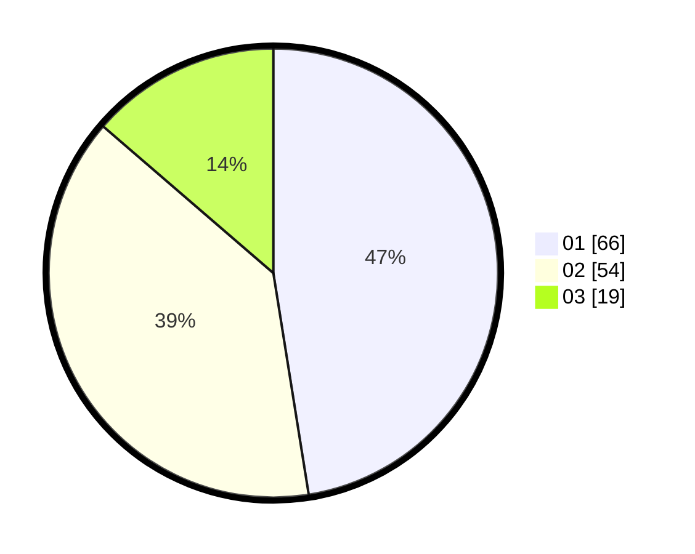

# Hasil

Hasil perolehan suara paslon dapat dilihat pada file paslon-01.txt, paslon-02.txt, dan paslon-03.txt.

Jika tidak ada, artinya data tersebut belum ada pada SIREKAP.

## Perolehan Suara

 * Paslon 01: **66**.
 * Paslon 02: **54**.
 * Paslon 03: **19**.

## Foto C Plano

https://sirekap-obj-formc.kpu.go.id/982c/pemilu/ppwp/31/71/07/10/05/3171071005007-20240214-234410--7b4fa2fc-b8f8-4f9b-9ad3-fa2a26f578f2.jpg

https://sirekap-obj-formc.kpu.go.id/982c/pemilu/ppwp/31/71/07/10/05/3171071005007-20240214-234722--b399f12a-e57d-4bf9-af7a-4a5c05207eb7.jpg

https://sirekap-obj-formc.kpu.go.id/982c/pemilu/ppwp/31/71/07/10/05/3171071005007-20240214-234627--cd1d215c-c8b5-4178-bdaa-352d2bafed8b.jpg

## DATA PEMILIH TETAP

Jumlah pemilih dalam DPT: **211**.
 * L: **114**.
 * P: **97**.

## DATA PENGGUNA HAK PILIH

Jumlah pengguna hak pilih dalam DPT: **142**.
 * L: **73**.
 * P: **69**.

Jumlah pengguna hak pilih dalam DPTb: **0**.
 * L: **0**.
 * P: **0**.

Jumlah pengguna hak pilih dalam DPK: **0**.
 * L: **0**.
 * P: **0**.

Jumlah pengguna hak pilih: **142**.
 * L: **73**.
 * P: **69**.

## JUMLAH SUARA SAH DAN TIDAK SAH

JUMLAH SELURUH SUARA SAH: **139**.

JUMLAH SUARA TIDAK SAH: **3**.

JUMLAH SELURUH SUARA SAH DAN SUARA TIDAK SAH: **142**.
