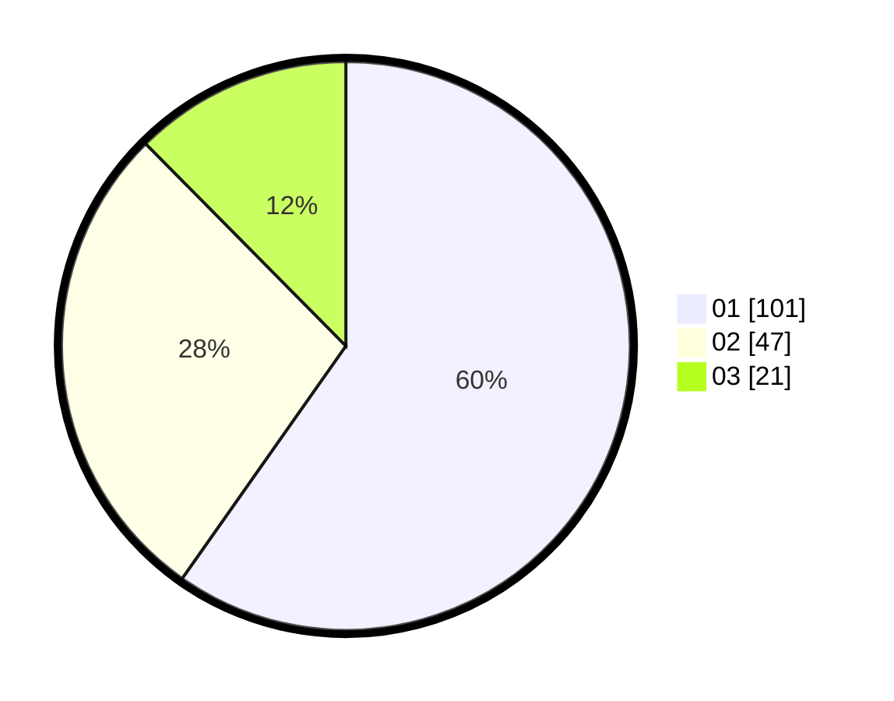

# Hasil

Hasil perolehan suara paslon dapat dilihat pada file paslon-01.txt, paslon-02.txt, dan paslon-03.txt.

Jika tidak ada, artinya data tersebut belum ada pada SIREKAP.

## Perolehan Suara

 * Paslon 01: **101**.
 * Paslon 02: **47**.
 * Paslon 03: **21**.

## Foto C Plano

https://sirekap-obj-formc.kpu.go.id/f1e1/pemilu/ppwp/31/71/07/10/05/3171071005008-20240215-001521--711fcb69-ee87-466b-919f-aed373c3a4ed.jpg

https://sirekap-obj-formc.kpu.go.id/f1e1/pemilu/ppwp/31/71/07/10/05/3171071005008-20240215-001610--8de289d0-5d9b-4f49-9548-2a82fc409af8.jpg
