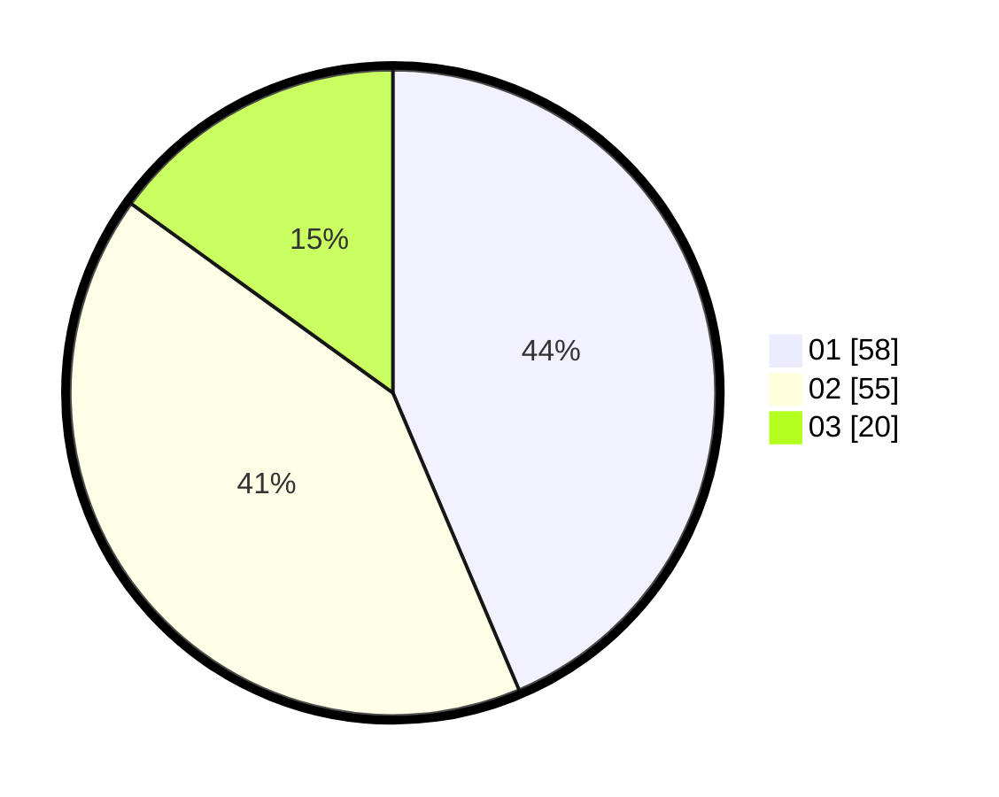

# Hasil

Hasil perolehan suara paslon dapat dilihat pada file paslon-01.txt, paslon-02.txt, dan paslon-03.txt.

Jika tidak ada, artinya data tersebut belum ada pada SIREKAP.

## Perolehan Suara

 * Paslon 01: **58**.
 * Paslon 02: **55**.
 * Paslon 03: **20**.

## Foto C Plano

https://sirekap-obj-formc.kpu.go.id/3c02/pemilu/ppwp/31/71/07/10/05/3171071005009-20240216-052650--2bf09762-63a7-4afa-864b-bf7fdb00595f.jpg

https://sirekap-obj-formc.kpu.go.id/3c02/pemilu/ppwp/31/71/07/10/05/3171071005009-20240216-052653--e981e925-b9e2-4e91-b839-8270f5639a4d.jpg

https://sirekap-obj-formc.kpu.go.id/3c02/pemilu/ppwp/31/71/07/10/05/3171071005009-20240216-052651--55096dda-bd98-4675-9155-cf4dd22cb0bc.jpg

## DATA PEMILIH TETAP

Jumlah pemilih dalam DPT: **123**.
 * L: **58**.
 * P: **65**.

## DATA PENGGUNA HAK PILIH

Jumlah pengguna hak pilih dalam DPT: **123**.
 * L: **58**.
 * P: **65**.

Jumlah pengguna hak pilih dalam DPTb: **4**.
 * L: **2**.
 * P: **2**.

Jumlah pengguna hak pilih dalam DPK: **8**.
 * L: **2**.
 * P: **6**.

Jumlah pengguna hak pilih: **135**.
 * L: **62**.
 * P: **73**.

## JUMLAH SUARA SAH DAN TIDAK SAH

JUMLAH SELURUH SUARA SAH: **133**.

JUMLAH SUARA TIDAK SAH: **2**.

JUMLAH SELURUH SUARA SAH DAN SUARA TIDAK SAH: **135**.
