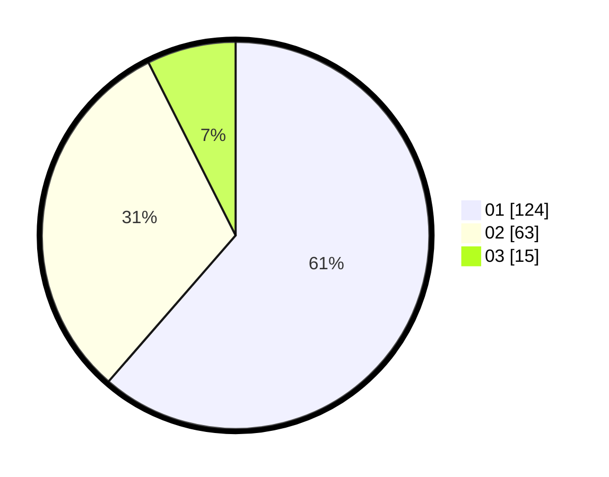

# Hasil

Hasil perolehan suara paslon dapat dilihat pada file paslon-01.txt, paslon-02.txt, dan paslon-03.txt.

Jika tidak ada, artinya data tersebut belum ada pada SIREKAP.

## Perolehan Suara

 * Paslon 01: **124**.
 * Paslon 02: **63**.
 * Paslon 03: **15**.

## Foto C Plano

https://sirekap-obj-formc.kpu.go.id/563a/pemilu/ppwp/31/71/07/10/05/3171071005015-20240215-012047--4511ed9c-cd2a-4c13-a8e1-1e593fd4050e.jpg

https://sirekap-obj-formc.kpu.go.id/563a/pemilu/ppwp/31/71/07/10/05/3171071005015-20240215-012309--bcc20f46-cf80-4407-895b-227ba3fabec1.jpg

https://sirekap-obj-formc.kpu.go.id/563a/pemilu/ppwp/31/71/07/10/05/3171071005015-20240215-012438--68b01ee2-89ac-40f7-bc4f-9bc6e4155c32.jpg
