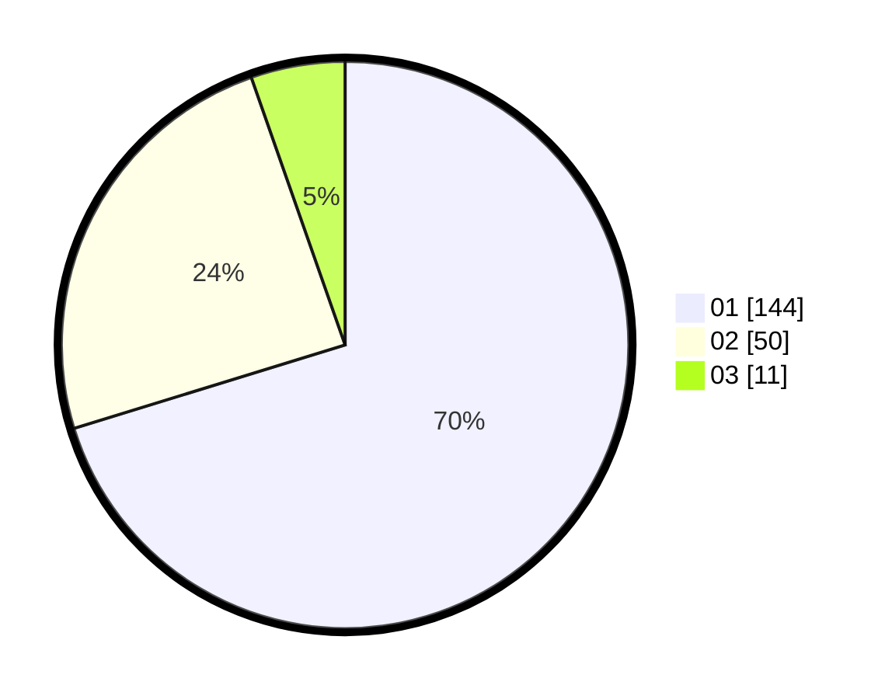

# Hasil

Hasil perolehan suara paslon dapat dilihat pada file paslon-01.txt, paslon-02.txt, dan paslon-03.txt.

Jika tidak ada, artinya data tersebut belum ada pada SIREKAP.

## Perolehan Suara

 * Paslon 01: **144**.
 * Paslon 02: **50**.
 * Paslon 03: **11**.

## Foto C Plano

https://sirekap-obj-formc.kpu.go.id/8562/pemilu/ppwp/31/71/07/10/05/3171071005017-20240216-214403--71b638b5-15e2-4834-95c7-b2453677a68b.jpg

https://sirekap-obj-formc.kpu.go.id/8562/pemilu/ppwp/31/71/07/10/05/3171071005017-20240216-215501--43c8ccf7-f8a6-4c18-b3c0-1e2ecfabce04.jpg
