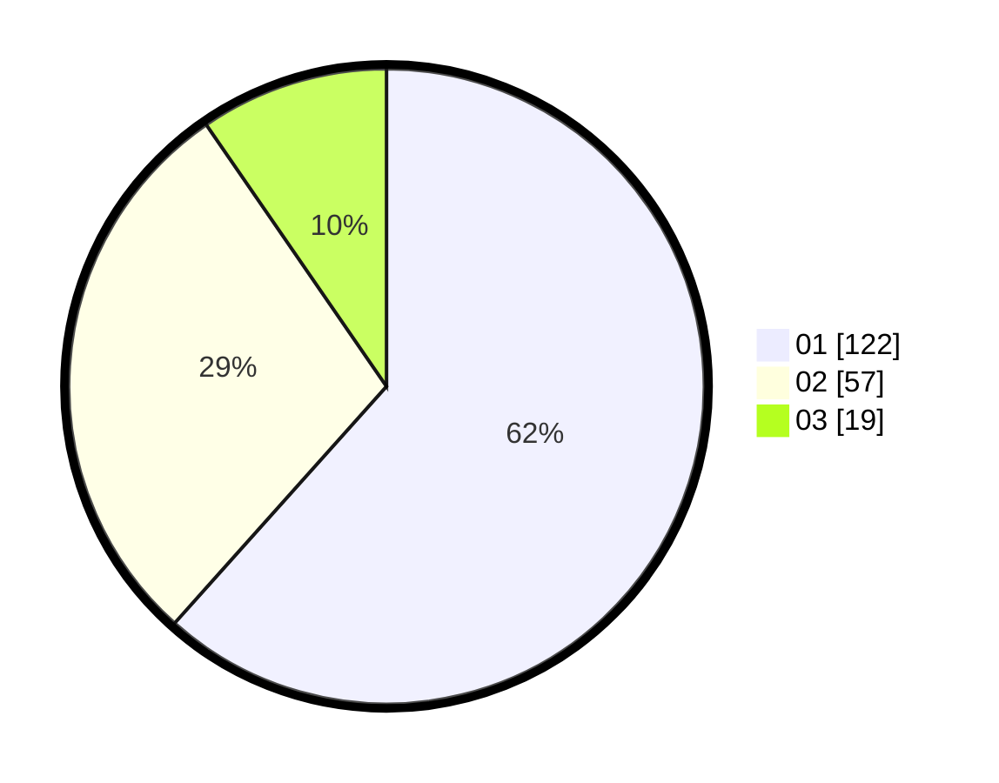

# Hasil

Hasil perolehan suara paslon dapat dilihat pada file paslon-01.txt, paslon-02.txt, dan paslon-03.txt.

Jika tidak ada, artinya data tersebut belum ada pada SIREKAP.

## Perolehan Suara

 * Paslon 01: **122**.
 * Paslon 02: **57**.
 * Paslon 03: **19**.

## Foto C Plano

https://sirekap-obj-formc.kpu.go.id/0d7b/pemilu/ppwp/31/71/07/10/05/3171071005020-20240214-212441--add42211-1015-4480-9d87-560db829e91d.jpg

https://sirekap-obj-formc.kpu.go.id/0d7b/pemilu/ppwp/31/71/07/10/05/3171071005020-20240214-212602--cfe65025-3b62-4947-ad77-0f3c48ff248a.jpg

https://sirekap-obj-formc.kpu.go.id/0d7b/pemilu/ppwp/31/71/07/10/05/3171071005020-20240214-212722--ef794d9a-4fba-47a6-bbda-11b32f1ef5aa.jpg
