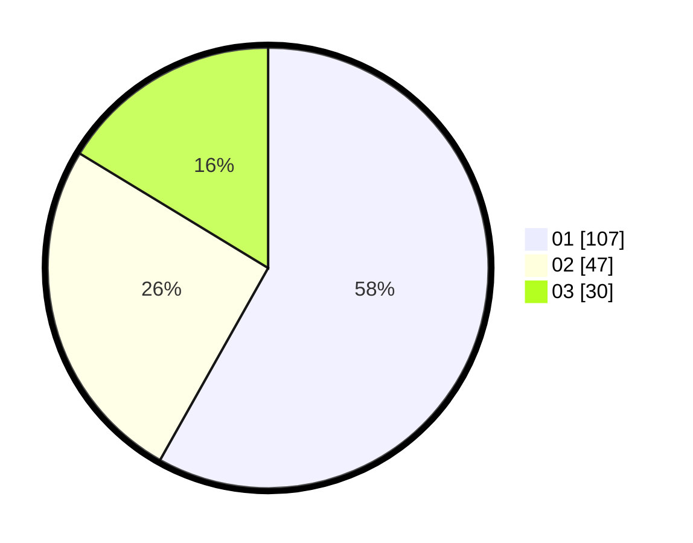

# Hasil

Hasil perolehan suara paslon dapat dilihat pada file paslon-01.txt, paslon-02.txt, dan paslon-03.txt.

Jika tidak ada, artinya data tersebut belum ada pada SIREKAP.

## Perolehan Suara

 * Paslon 01: **107**.
 * Paslon 02: **47**.
 * Paslon 03: **30**.

## Foto C Plano

https://sirekap-obj-formc.kpu.go.id/9815/pemilu/ppwp/31/71/07/10/05/3171071005026-20240215-000332--4880b672-770d-4c54-a1a2-5f32d7974d98.jpg

https://sirekap-obj-formc.kpu.go.id/9815/pemilu/ppwp/31/71/07/10/05/3171071005026-20240215-000359--ce794dae-2a2d-4290-8dd6-3768f2d145d9.jpg

https://sirekap-obj-formc.kpu.go.id/9815/pemilu/ppwp/31/71/07/10/05/3171071005026-20240215-000420--7abdfde2-a628-43d2-ad7c-2c2615125753.jpg

## DATA PEMILIH TETAP

Jumlah pemilih dalam DPT: **245**.
 * L: **122**.
 * P: **123**.

## DATA PENGGUNA HAK PILIH

Jumlah pengguna hak pilih dalam DPT: **172**.
 * L: **83**.
 * P: **89**.

Jumlah pengguna hak pilih dalam DPTb: **9**.
 * L: **2**.
 * P: **7**.

Jumlah pengguna hak pilih dalam DPK: **2**.
 * L: **0**.
 * P: **2**.

Jumlah pengguna hak pilih: **183**.
 * L: **85**.
 * P: **98**.

## JUMLAH SUARA SAH DAN TIDAK SAH

JUMLAH SELURUH SUARA SAH: **178**.

JUMLAH SUARA TIDAK SAH: **5**.

JUMLAH SELURUH SUARA SAH DAN SUARA TIDAK SAH: **183**.
