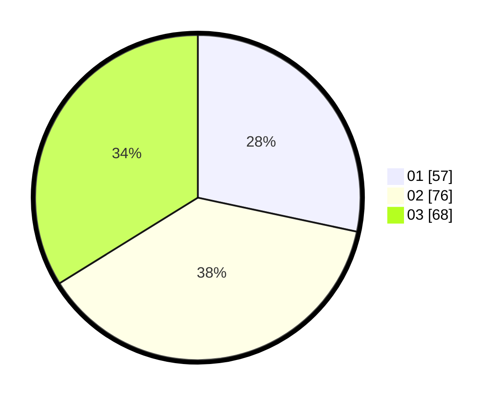

# Hasil

Hasil perolehan suara paslon dapat dilihat pada file paslon-01.txt, paslon-02.txt, dan paslon-03.txt.

Jika tidak ada, artinya data tersebut belum ada pada SIREKAP.

## Perolehan Suara

 * Paslon 01: **57**.
 * Paslon 02: **76**.
 * Paslon 03: **68**.

## Foto C Plano

https://sirekap-obj-formc.kpu.go.id/cd3c/pemilu/ppwp/31/71/07/10/05/3171071005027-20240214-155057--b603b468-bf3e-4255-9512-fdcdcf60449f.jpg

https://sirekap-obj-formc.kpu.go.id/cd3c/pemilu/ppwp/31/71/07/10/05/3171071005027-20240214-155835--2eff0bd3-b8c3-4a3f-ad64-6a793c59395e.jpg

https://sirekap-obj-formc.kpu.go.id/cd3c/pemilu/ppwp/31/71/07/10/05/3171071005027-20240214-155918--46a9aca0-7f6b-4055-bd73-5fe9c2de9c6b.jpg
