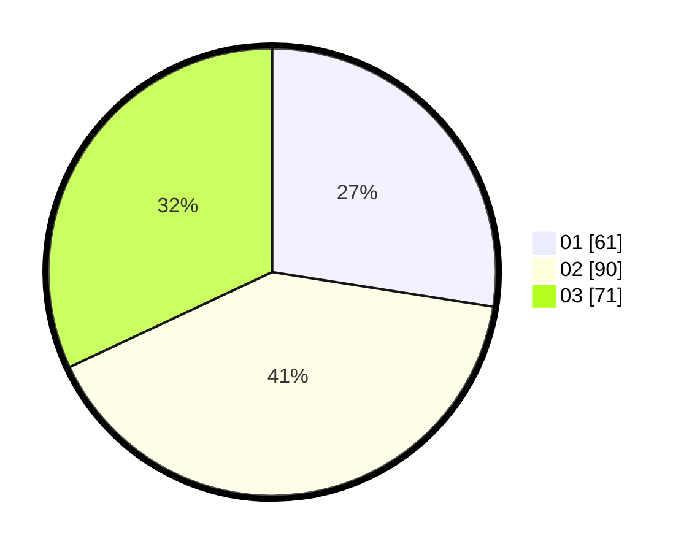

# Hasil

Hasil perolehan suara paslon dapat dilihat pada file paslon-01.txt, paslon-02.txt, dan paslon-03.txt.

Jika tidak ada, artinya data tersebut belum ada pada SIREKAP.

## Perolehan Suara

 * Paslon 01: **61**.
 * Paslon 02: **90**.
 * Paslon 03: **71**.

## Foto C Plano

https://sirekap-obj-formc.kpu.go.id/bd96/pemilu/ppwp/31/71/07/10/05/3171071005028-20240214-234535--3a1a082c-92d1-4d52-956c-4aa4ce4897cb.jpg

https://sirekap-obj-formc.kpu.go.id/bd96/pemilu/ppwp/31/71/07/10/05/3171071005028-20240214-234700--2e90e198-5cf2-47f6-8017-ea8179fa9bdb.jpg

https://sirekap-obj-formc.kpu.go.id/bd96/pemilu/ppwp/31/71/07/10/05/3171071005028-20240214-234812--9ce43112-e2a2-41db-9c60-4a112cc1665f.jpg
