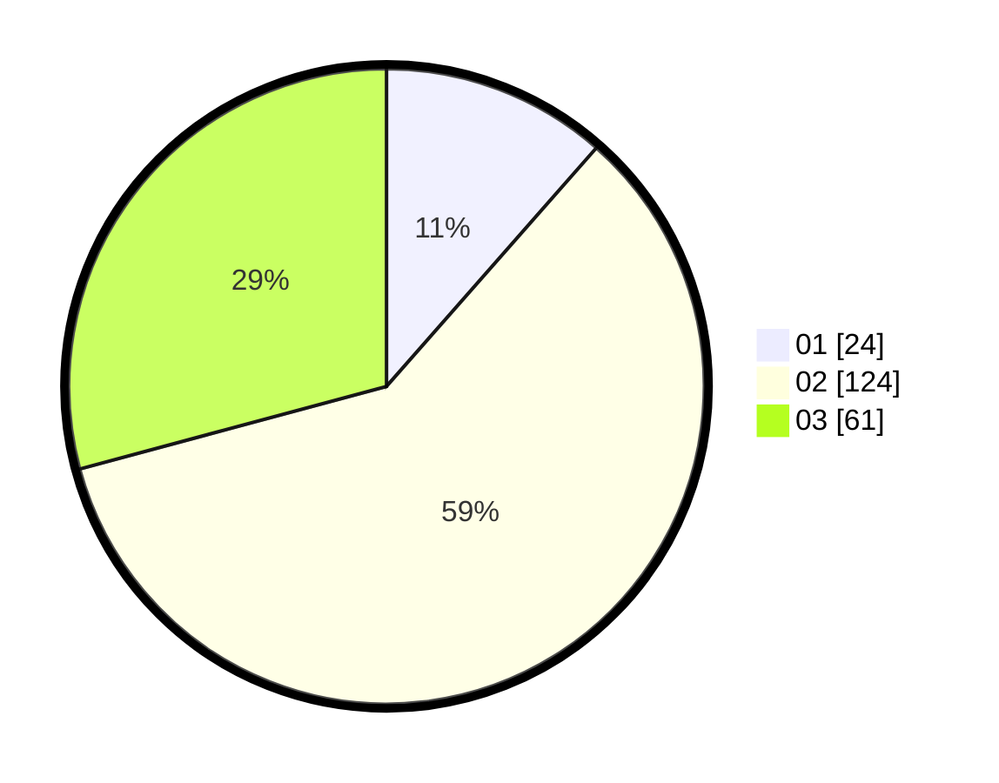

# Hasil

Hasil perolehan suara paslon dapat dilihat pada file paslon-01.txt, paslon-02.txt, dan paslon-03.txt.

Jika tidak ada, artinya data tersebut belum ada pada SIREKAP.

## Perolehan Suara

 * Paslon 01: **24**.
 * Paslon 02: **124**.
 * Paslon 03: **61**.

## Foto C Plano

https://sirekap-obj-formc.kpu.go.id/df79/pemilu/ppwp/31/71/07/10/05/3171071005031-20240214-205610--82863ba7-a843-4065-adc6-4f3606189ccc.jpg

https://sirekap-obj-formc.kpu.go.id/df79/pemilu/ppwp/31/71/07/10/05/3171071005031-20240214-205715--c81a6386-8346-4d64-bff0-365ddee4262d.jpg
