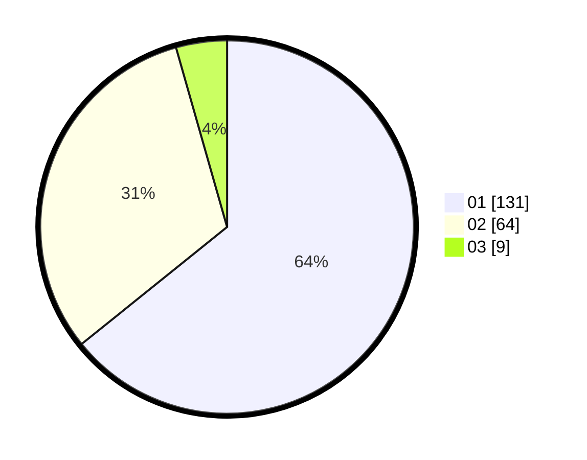

# Hasil

Hasil perolehan suara paslon dapat dilihat pada file paslon-01.txt, paslon-02.txt, dan paslon-03.txt.

Jika tidak ada, artinya data tersebut belum ada pada SIREKAP.

## Perolehan Suara

 * Paslon 01: **131**.
 * Paslon 02: **64**.
 * Paslon 03: **9**.

## Foto C Plano

https://sirekap-obj-formc.kpu.go.id/1100/pemilu/ppwp/31/71/07/10/05/3171071005034-20240215-010301--d9d48f5b-6c4a-48f6-b20a-66595503b9ea.jpg

https://sirekap-obj-formc.kpu.go.id/1100/pemilu/ppwp/31/71/07/10/05/3171071005034-20240215-010337--604a1249-2cc7-40aa-a9ab-0c20978b9261.jpg

https://sirekap-obj-formc.kpu.go.id/1100/pemilu/ppwp/31/71/07/10/05/3171071005034-20240215-010431--44551bba-9c3d-49cf-b7a4-dc4bb81cae32.jpg
