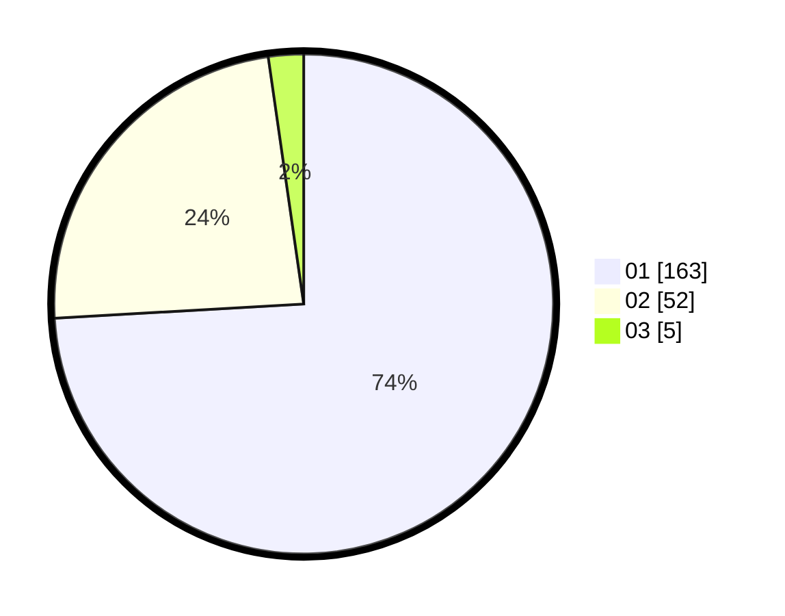

# Hasil

Hasil perolehan suara paslon dapat dilihat pada file paslon-01.txt, paslon-02.txt, dan paslon-03.txt.

Jika tidak ada, artinya data tersebut belum ada pada SIREKAP.

## Perolehan Suara

 * Paslon 01: **163**.
 * Paslon 02: **52**.
 * Paslon 03: **5**.

## Foto C Plano

https://sirekap-obj-formc.kpu.go.id/4fe6/pemilu/ppwp/31/71/07/10/05/3171071005036-20240214-233327--b961815a-2809-49ba-94a0-c88369ada8fc.jpg

https://sirekap-obj-formc.kpu.go.id/4fe6/pemilu/ppwp/31/71/07/10/05/3171071005036-20240214-233923--4f042948-5642-4ede-b957-b6ad08d59770.jpg

https://sirekap-obj-formc.kpu.go.id/4fe6/pemilu/ppwp/31/71/07/10/05/3171071005036-20240214-234409--f1f2e3bb-e542-483c-8c2c-139ae8fc3bea.jpg

## DATA PEMILIH TETAP

Jumlah pemilih dalam DPT: **272**.
 * L: **132**.
 * P: **140**.

## DATA PENGGUNA HAK PILIH

Jumlah pengguna hak pilih dalam DPT: **219**.
 * L: **102**.
 * P: **117**.

Jumlah pengguna hak pilih dalam DPTb: **2**.
 * L: **1**.
 * P: **1**.

Jumlah pengguna hak pilih dalam DPK: **0**.
 * L: **0**.
 * P: **0**.

Jumlah pengguna hak pilih: **221**.
 * L: **103**.
 * P: **118**.

## JUMLAH SUARA SAH DAN TIDAK SAH

JUMLAH SELURUH SUARA SAH: **220**.

JUMLAH SUARA TIDAK SAH: **1**.

JUMLAH SELURUH SUARA SAH DAN SUARA TIDAK SAH: **221**.
