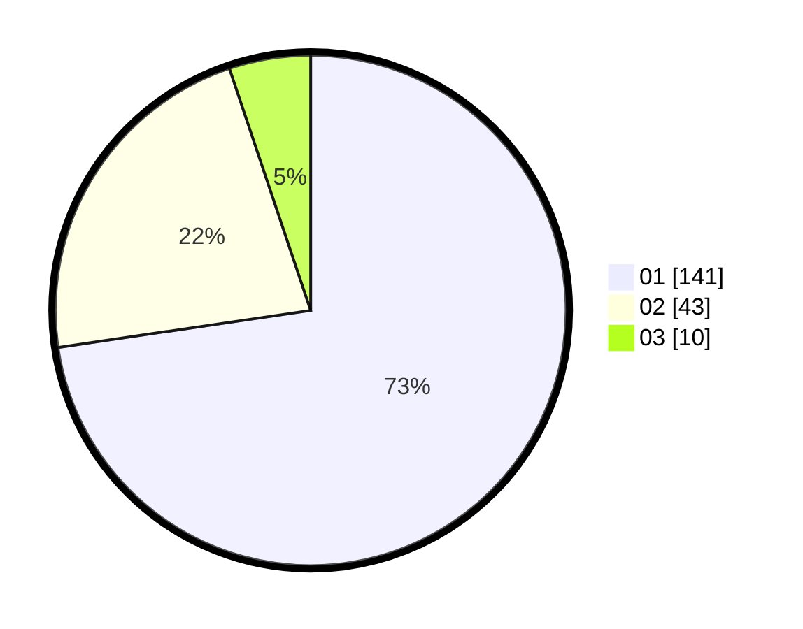

# Hasil

Hasil perolehan suara paslon dapat dilihat pada file paslon-01.txt, paslon-02.txt, dan paslon-03.txt.

Jika tidak ada, artinya data tersebut belum ada pada SIREKAP.

## Perolehan Suara

 * Paslon 01: **141**.
 * Paslon 02: **43**.
 * Paslon 03: **10**.

## Foto C Plano

https://sirekap-obj-formc.kpu.go.id/0d4c/pemilu/ppwp/31/71/07/10/05/3171071005037-20240216-190427--0e75fed3-35a0-4c02-81cc-bbb9f765beb7.jpg

https://sirekap-obj-formc.kpu.go.id/0d4c/pemilu/ppwp/31/71/07/10/05/3171071005037-20240216-190429--552d25cb-053e-47da-b89b-477a275e9a92.jpg

https://sirekap-obj-formc.kpu.go.id/0d4c/pemilu/ppwp/31/71/07/10/05/3171071005037-20240216-190428--f075f7cb-e8e3-4168-85ed-d75fd32b2c72.jpg

## DATA PEMILIH TETAP

Jumlah pemilih dalam DPT: **268**.
 * L: **140**.
 * P: **128**.

## DATA PENGGUNA HAK PILIH

Jumlah pengguna hak pilih dalam DPT: **196**.
 * L: **100**.
 * P: **96**.

Jumlah pengguna hak pilih dalam DPTb: **0**.
 * L: **0**.
 * P: **0**.

Jumlah pengguna hak pilih dalam DPK: **0**.
 * L: **0**.
 * P: **0**.

Jumlah pengguna hak pilih: **196**.
 * L: **100**.
 * P: **96**.

## JUMLAH SUARA SAH DAN TIDAK SAH

JUMLAH SELURUH SUARA SAH: **194**.

JUMLAH SUARA TIDAK SAH: **2**.

JUMLAH SELURUH SUARA SAH DAN SUARA TIDAK SAH: **196**.
