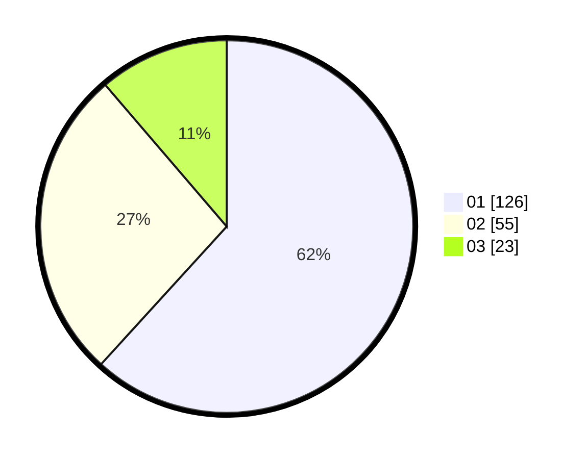

# Hasil

Hasil perolehan suara paslon dapat dilihat pada file paslon-01.txt, paslon-02.txt, dan paslon-03.txt.

Jika tidak ada, artinya data tersebut belum ada pada SIREKAP.

## Perolehan Suara

 * Paslon 01: **126**.
 * Paslon 02: **55**.
 * Paslon 03: **23**.

## Foto C Plano

https://sirekap-obj-formc.kpu.go.id/803c/pemilu/ppwp/31/71/07/10/05/3171071005038-20240216-195042--4ee82d2a-6cf5-4530-a494-2b47e8c3943a.jpg

https://sirekap-obj-formc.kpu.go.id/803c/pemilu/ppwp/31/71/07/10/05/3171071005038-20240216-195044--6cfe73b3-1b3b-4c9e-a26e-81778b16aa67.jpg

https://sirekap-obj-formc.kpu.go.id/803c/pemilu/ppwp/31/71/07/10/05/3171071005038-20240216-195043--0b2f03ca-4b2c-4430-8cd9-67ac9795d1dd.jpg

## DATA PEMILIH TETAP

Jumlah pemilih dalam DPT: **272**.
 * L: **134**.
 * P: **138**.

## DATA PENGGUNA HAK PILIH

Jumlah pengguna hak pilih dalam DPT: **199**.
 * L: **99**.
 * P: **100**.

Jumlah pengguna hak pilih dalam DPTb: **1**.
 * L: **0**.
 * P: **1**.

Jumlah pengguna hak pilih dalam DPK: **4**.
 * L: **2**.
 * P: **2**.

Jumlah pengguna hak pilih: **204**.
 * L: **101**.
 * P: **103**.

## JUMLAH SUARA SAH DAN TIDAK SAH

JUMLAH SELURUH SUARA SAH: **204**.

JUMLAH SUARA TIDAK SAH: **0**.

JUMLAH SELURUH SUARA SAH DAN SUARA TIDAK SAH: **204**.
