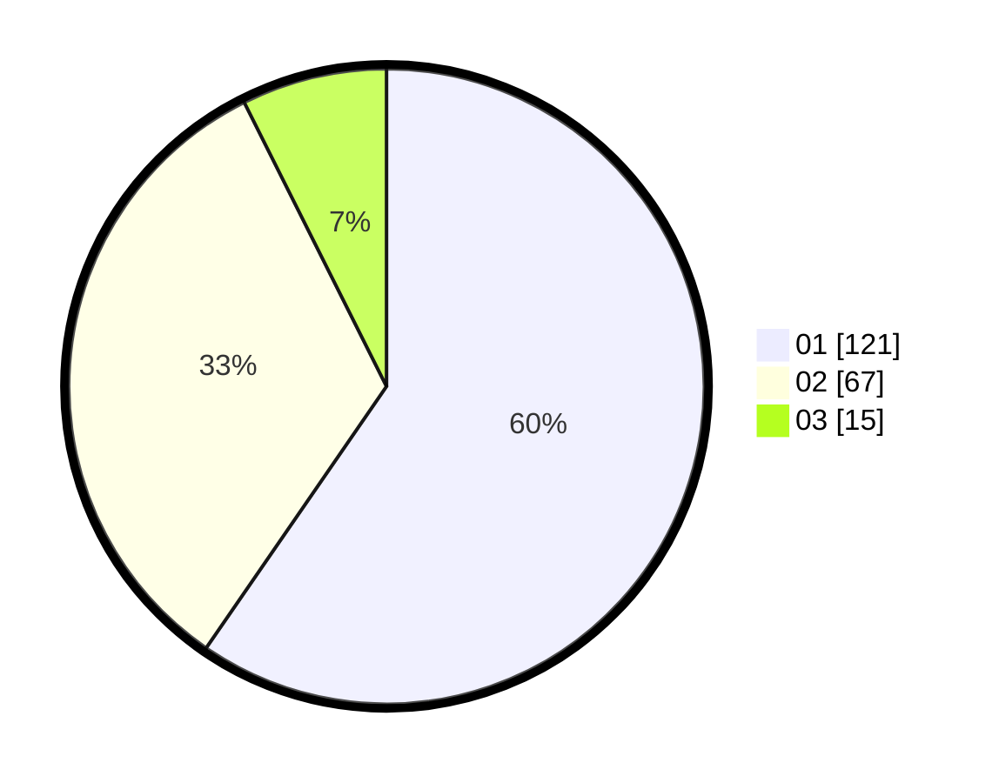

# Hasil

Hasil perolehan suara paslon dapat dilihat pada file paslon-01.txt, paslon-02.txt, dan paslon-03.txt.

Jika tidak ada, artinya data tersebut belum ada pada SIREKAP.

## Perolehan Suara

 * Paslon 01: **121**.
 * Paslon 02: **67**.
 * Paslon 03: **15**.

## Foto C Plano

https://sirekap-obj-formc.kpu.go.id/3318/pemilu/ppwp/31/71/07/10/05/3171071005041-20240215-015158--494b08e6-bcbb-4329-b040-99410875bbcf.jpg

https://sirekap-obj-formc.kpu.go.id/3318/pemilu/ppwp/31/71/07/10/05/3171071005041-20240215-015317--87de2623-972d-47c3-8b74-0066832061e2.jpg
