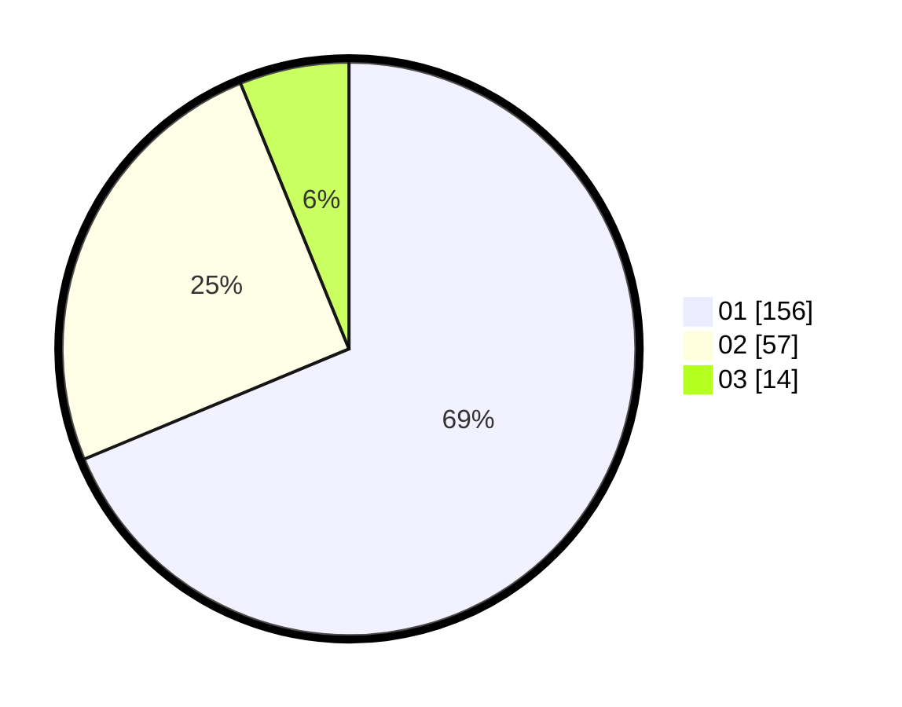

# Hasil

Hasil perolehan suara paslon dapat dilihat pada file paslon-01.txt, paslon-02.txt, dan paslon-03.txt.

Jika tidak ada, artinya data tersebut belum ada pada SIREKAP.

## Perolehan Suara

 * Paslon 01: **156**.
 * Paslon 02: **57**.
 * Paslon 03: **14**.

## Foto C Plano

https://sirekap-obj-formc.kpu.go.id/3b6f/pemilu/ppwp/31/71/07/10/05/3171071005042-20240214-211451--b7c73d9a-ae49-403d-8af5-b4e2c138506f.jpg

https://sirekap-obj-formc.kpu.go.id/3b6f/pemilu/ppwp/31/71/07/10/05/3171071005042-20240214-211835--0fc1f5d5-545f-4fc8-9a1d-73cccd4ccfeb.jpg

https://sirekap-obj-formc.kpu.go.id/3b6f/pemilu/ppwp/31/71/07/10/05/3171071005042-20240214-212014--1becdf50-22e6-4f27-89c0-11ec6cefa377.jpg
