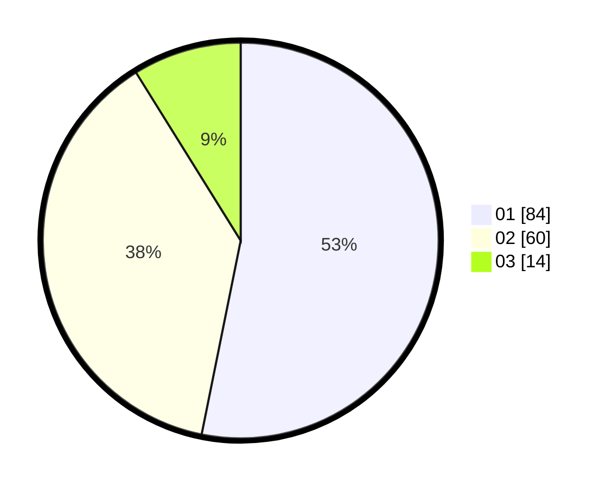

# Hasil

Hasil perolehan suara paslon dapat dilihat pada file paslon-01.txt, paslon-02.txt, dan paslon-03.txt.

Jika tidak ada, artinya data tersebut belum ada pada SIREKAP.

## Perolehan Suara

 * Paslon 01: **84**.
 * Paslon 02: **60**.
 * Paslon 03: **14**.

## Foto C Plano

https://sirekap-obj-formc.kpu.go.id/fb8e/pemilu/ppwp/31/71/07/10/05/3171071005045-20240214-160105--534c5f03-bb1b-4121-9d76-aafcf7789e3a.jpg

https://sirekap-obj-formc.kpu.go.id/fb8e/pemilu/ppwp/31/71/07/10/05/3171071005045-20240214-155416--2f14f035-5513-4337-b4bc-430e2b1745c7.jpg

https://sirekap-obj-formc.kpu.go.id/fb8e/pemilu/ppwp/31/71/07/10/05/3171071005045-20240214-155610--d48d03cd-a056-4540-85db-385a15de4ffe.jpg

## DATA PEMILIH TETAP

Jumlah pemilih dalam DPT: **259**.
 * L: **137**.
 * P: **122**.

## DATA PENGGUNA HAK PILIH

Jumlah pengguna hak pilih dalam DPT: **160**.
 * L: **81**.
 * P: **79**.

Jumlah pengguna hak pilih dalam DPTb: **0**.
 * L: **0**.
 * P: **0**.

Jumlah pengguna hak pilih dalam DPK: **0**.
 * L: **0**.
 * P: **0**.

Jumlah pengguna hak pilih: **160**.
 * L: **81**.
 * P: **79**.

## JUMLAH SUARA SAH DAN TIDAK SAH

JUMLAH SELURUH SUARA SAH: **158**.

JUMLAH SUARA TIDAK SAH: **2**.

JUMLAH SELURUH SUARA SAH DAN SUARA TIDAK SAH: **160**.
