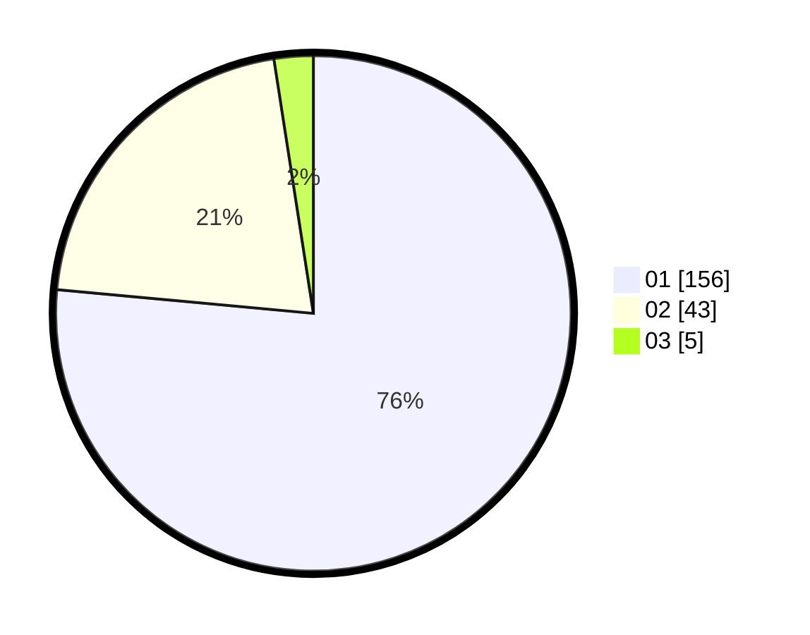

# Hasil

Hasil perolehan suara paslon dapat dilihat pada file paslon-01.txt, paslon-02.txt, dan paslon-03.txt.

Jika tidak ada, artinya data tersebut belum ada pada SIREKAP.

## Perolehan Suara

 * Paslon 01: **156**.
 * Paslon 02: **43**.
 * Paslon 03: **5**.

## Foto C Plano

https://sirekap-obj-formc.kpu.go.id/04e3/pemilu/ppwp/31/71/07/10/05/3171071005049-20240214-204755--3da27b3f-fb24-499f-a086-953eace8931b.jpg

https://sirekap-obj-formc.kpu.go.id/04e3/pemilu/ppwp/31/71/07/10/05/3171071005049-20240214-205236--849145d4-4bde-48a1-8748-3dba286d91b1.jpg

https://sirekap-obj-formc.kpu.go.id/04e3/pemilu/ppwp/31/71/07/10/05/3171071005049-20240214-223044--3f864d32-51a1-4b12-aa05-d944d16b4cb1.jpg
