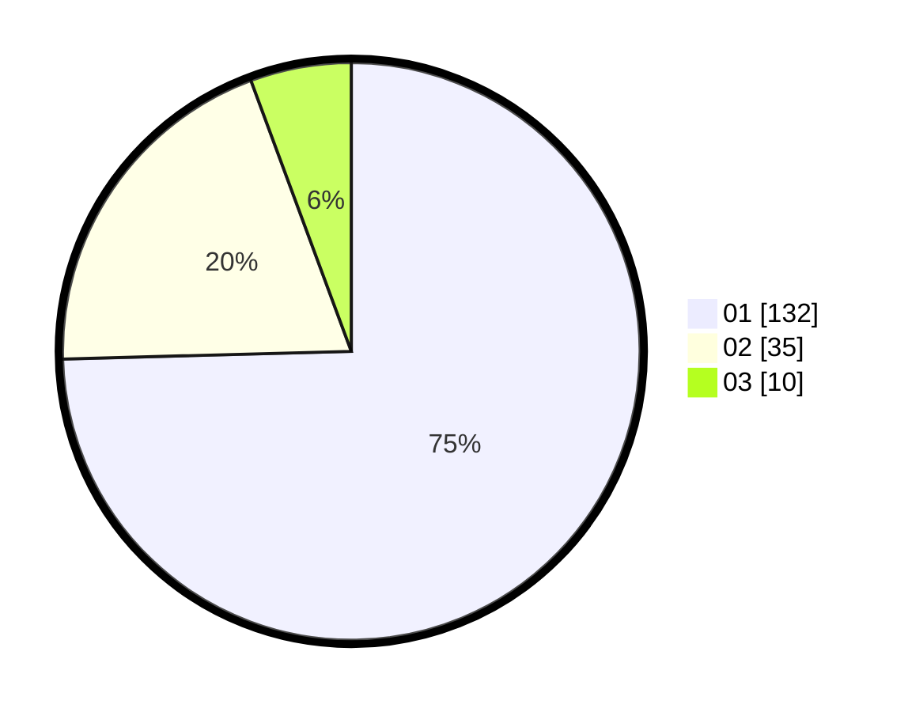

# Hasil

Hasil perolehan suara paslon dapat dilihat pada file paslon-01.txt, paslon-02.txt, dan paslon-03.txt.

Jika tidak ada, artinya data tersebut belum ada pada SIREKAP.

## Perolehan Suara

 * Paslon 01: **132**.
 * Paslon 02: **35**.
 * Paslon 03: **10**.

## Foto C Plano

https://sirekap-obj-formc.kpu.go.id/467a/pemilu/ppwp/31/71/07/10/05/3171071005052-20240214-201528--59182813-d0a0-4d33-b76a-39c214595c05.jpg

https://sirekap-obj-formc.kpu.go.id/467a/pemilu/ppwp/31/71/07/10/05/3171071005052-20240214-201750--ae71afcd-61bb-4b8c-9293-c5fb71bff7f0.jpg

https://sirekap-obj-formc.kpu.go.id/467a/pemilu/ppwp/31/71/07/10/05/3171071005052-20240214-201937--ed02eb58-05a1-4413-aaa2-5511908f7a78.jpg

## DATA PEMILIH TETAP

Jumlah pemilih dalam DPT: **249**.
 * L: **120**.
 * P: **129**.

## DATA PENGGUNA HAK PILIH

Jumlah pengguna hak pilih dalam DPT: **171**.
 * L: **83**.
 * P: **88**.

Jumlah pengguna hak pilih dalam DPTb: **4**.
 * L: **0**.
 * P: **4**.

Jumlah pengguna hak pilih dalam DPK: **4**.
 * L: **1**.
 * P: **3**.

Jumlah pengguna hak pilih: **179**.
 * L: **84**.
 * P: **95**.

## JUMLAH SUARA SAH DAN TIDAK SAH

JUMLAH SELURUH SUARA SAH: **177**.

JUMLAH SUARA TIDAK SAH: **2**.

JUMLAH SELURUH SUARA SAH DAN SUARA TIDAK SAH: **179**.
