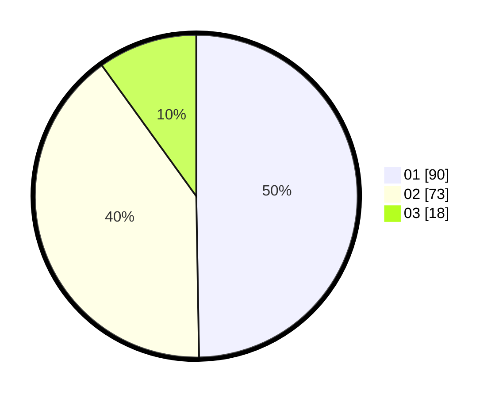

# Hasil

Hasil perolehan suara paslon dapat dilihat pada file paslon-01.txt, paslon-02.txt, dan paslon-03.txt.

Jika tidak ada, artinya data tersebut belum ada pada SIREKAP.

## Perolehan Suara

 * Paslon 01: **90**.
 * Paslon 02: **73**.
 * Paslon 03: **18**.

## Foto C Plano

https://sirekap-obj-formc.kpu.go.id/21b0/pemilu/ppwp/31/71/07/10/05/3171071005060-20240214-195446--c8da0e98-8140-4bf0-b3ec-6bd403d6f078.jpg

https://sirekap-obj-formc.kpu.go.id/21b0/pemilu/ppwp/31/71/07/10/05/3171071005060-20240214-195555--aa72d111-ed60-4850-964a-5eb7c73fcfad.jpg

https://sirekap-obj-formc.kpu.go.id/21b0/pemilu/ppwp/31/71/07/10/05/3171071005060-20240214-195635--97eda236-5576-4387-8c01-0f87befa208b.jpg

## DATA PEMILIH TETAP

Jumlah pemilih dalam DPT: **263**.
 * L: **129**.
 * P: **134**.

## DATA PENGGUNA HAK PILIH

Jumlah pengguna hak pilih dalam DPT: **182**.
 * L: **91**.
 * P: **91**.

Jumlah pengguna hak pilih dalam DPTb: **0**.
 * L: **0**.
 * P: **0**.

Jumlah pengguna hak pilih dalam DPK: **0**.
 * L: **0**.
 * P: **0**.

Jumlah pengguna hak pilih: **182**.
 * L: **91**.
 * P: **91**.

## JUMLAH SUARA SAH DAN TIDAK SAH

JUMLAH SELURUH SUARA SAH: **181**.

JUMLAH SUARA TIDAK SAH: **1**.

JUMLAH SELURUH SUARA SAH DAN SUARA TIDAK SAH: **182**.
