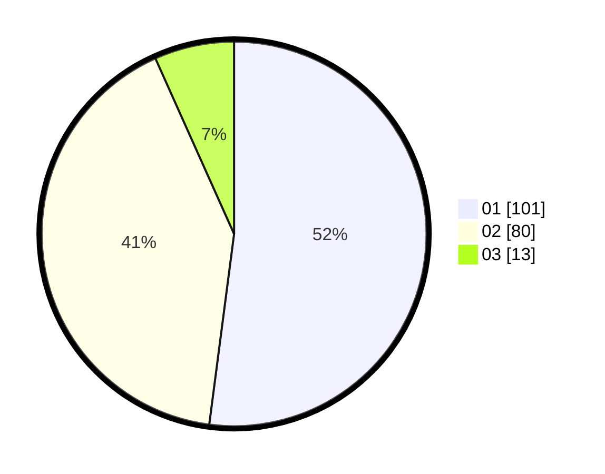

# Hasil

Hasil perolehan suara paslon dapat dilihat pada file paslon-01.txt, paslon-02.txt, dan paslon-03.txt.

Jika tidak ada, artinya data tersebut belum ada pada SIREKAP.

## Perolehan Suara

 * Paslon 01: **101**.
 * Paslon 02: **80**.
 * Paslon 03: **13**.

## Foto C Plano

https://sirekap-obj-formc.kpu.go.id/7eb1/pemilu/ppwp/31/71/07/10/05/3171071005062-20240214-203527--4e575409-5b54-4695-9554-fe74d4ff991f.jpg

https://sirekap-obj-formc.kpu.go.id/7eb1/pemilu/ppwp/31/71/07/10/05/3171071005062-20240214-203542--cbf3a822-8a23-4215-906b-e3b66dfa3110.jpg

https://sirekap-obj-formc.kpu.go.id/7eb1/pemilu/ppwp/31/71/07/10/05/3171071005062-20240214-203612--774e4777-6fd0-4fe5-b970-10d6d2e823b8.jpg

## DATA PEMILIH TETAP

Jumlah pemilih dalam DPT: **199**.
 * L: **100**.
 * P: **99**.

## DATA PENGGUNA HAK PILIH

Jumlah pengguna hak pilih dalam DPT: **199**.
 * L: **100**.
 * P: **99**.

Jumlah pengguna hak pilih dalam DPTb: **4**.
 * L: **4**.
 * P: **0**.

Jumlah pengguna hak pilih dalam DPK: **3**.
 * L: **3**.
 * P: **0**.

Jumlah pengguna hak pilih: **206**.
 * L: **107**.
 * P: **99**.

## JUMLAH SUARA SAH DAN TIDAK SAH

JUMLAH SELURUH SUARA SAH: **194**.

JUMLAH SUARA TIDAK SAH: **12**.

JUMLAH SELURUH SUARA SAH DAN SUARA TIDAK SAH: **206**.
