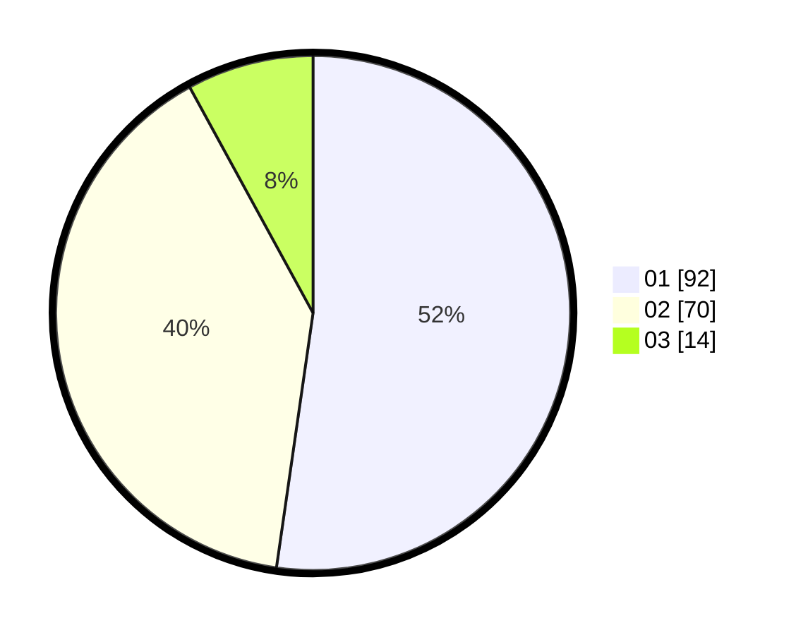

# Hasil

Hasil perolehan suara paslon dapat dilihat pada file paslon-01.txt, paslon-02.txt, dan paslon-03.txt.

Jika tidak ada, artinya data tersebut belum ada pada SIREKAP.

## Perolehan Suara

 * Paslon 01: **92**.
 * Paslon 02: **70**.
 * Paslon 03: **14**.

## Foto C Plano

https://sirekap-obj-formc.kpu.go.id/905b/pemilu/ppwp/31/71/07/10/05/3171071005064-20240214-222919--b5912380-c55d-485a-b1d4-52c9158f95d0.jpg

https://sirekap-obj-formc.kpu.go.id/905b/pemilu/ppwp/31/71/07/10/05/3171071005064-20240214-223110--bd2f1a62-247e-4c1e-b081-eabf3cebdb2e.jpg

https://sirekap-obj-formc.kpu.go.id/905b/pemilu/ppwp/31/71/07/10/05/3171071005064-20240214-223243--08128a03-d218-4e4f-b515-b5c81cec36ba.jpg
