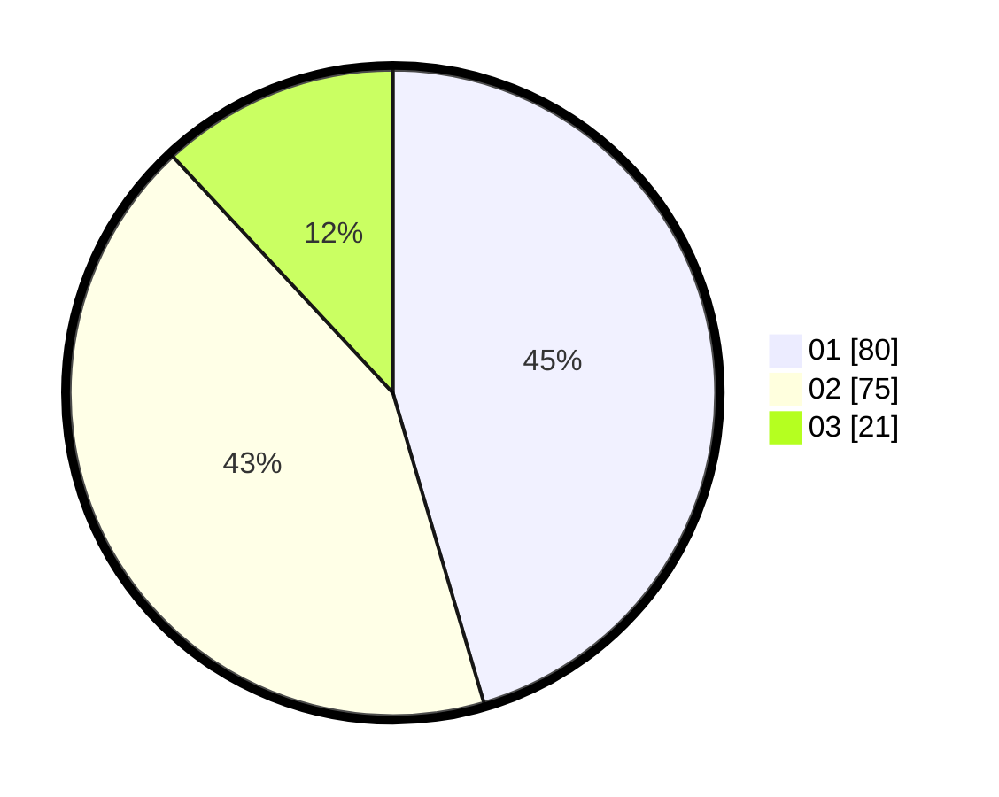

# Hasil

Hasil perolehan suara paslon dapat dilihat pada file paslon-01.txt, paslon-02.txt, dan paslon-03.txt.

Jika tidak ada, artinya data tersebut belum ada pada SIREKAP.

## Perolehan Suara

 * Paslon 01: **80**.
 * Paslon 02: **75**.
 * Paslon 03: **21**.

## Foto C Plano

https://sirekap-obj-formc.kpu.go.id/6480/pemilu/ppwp/31/71/07/10/05/3171071005067-20240214-185319--b283156d-1106-4624-bf2a-07b91d7d2501.jpg

https://sirekap-obj-formc.kpu.go.id/6480/pemilu/ppwp/31/71/07/10/05/3171071005067-20240214-214310--e5aaccbf-1130-41ae-bc6a-615e735046df.jpg

https://sirekap-obj-formc.kpu.go.id/6480/pemilu/ppwp/31/71/07/10/05/3171071005067-20240214-185622--cea391ec-07a5-4778-94cc-47d21cc35a93.jpg

## DATA PEMILIH TETAP

Jumlah pemilih dalam DPT: **281**.
 * L: **146**.
 * P: **135**.

## DATA PENGGUNA HAK PILIH

Jumlah pengguna hak pilih dalam DPT: **177**.
 * L: **85**.
 * P: **92**.

Jumlah pengguna hak pilih dalam DPTb: **1**.
 * L: **1**.
 * P: **0**.

Jumlah pengguna hak pilih dalam DPK: **1**.
 * L: **1**.
 * P: **0**.

Jumlah pengguna hak pilih: **179**.
 * L: **87**.
 * P: **92**.

## JUMLAH SUARA SAH DAN TIDAK SAH

JUMLAH SELURUH SUARA SAH: **176**.

JUMLAH SUARA TIDAK SAH: **3**.

JUMLAH SELURUH SUARA SAH DAN SUARA TIDAK SAH: **179**.
