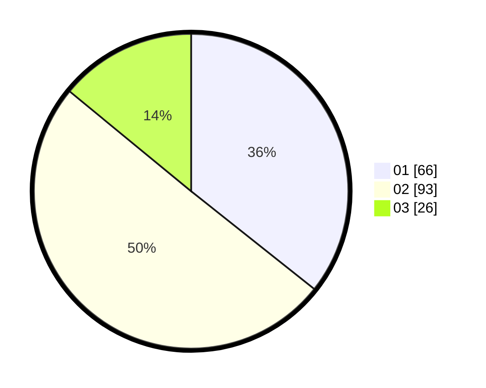

# Hasil

Hasil perolehan suara paslon dapat dilihat pada file paslon-01.txt, paslon-02.txt, dan paslon-03.txt.

Jika tidak ada, artinya data tersebut belum ada pada SIREKAP.

## Perolehan Suara

 * Paslon 01: **66**.
 * Paslon 02: **93**.
 * Paslon 03: **26**.

## Foto C Plano

https://sirekap-obj-formc.kpu.go.id/12e7/pemilu/ppwp/31/71/07/10/05/3171071005068-20240215-002041--5c86364f-fddd-4e41-8f79-7664e065af60.jpg

https://sirekap-obj-formc.kpu.go.id/12e7/pemilu/ppwp/31/71/07/10/05/3171071005068-20240215-002217--3a484b90-b9dd-44eb-ac4d-1e89aff6c077.jpg

https://sirekap-obj-formc.kpu.go.id/12e7/pemilu/ppwp/31/71/07/10/05/3171071005068-20240215-002424--7ac9e9cc-3915-487d-96d0-a55cabf6aee4.jpg
