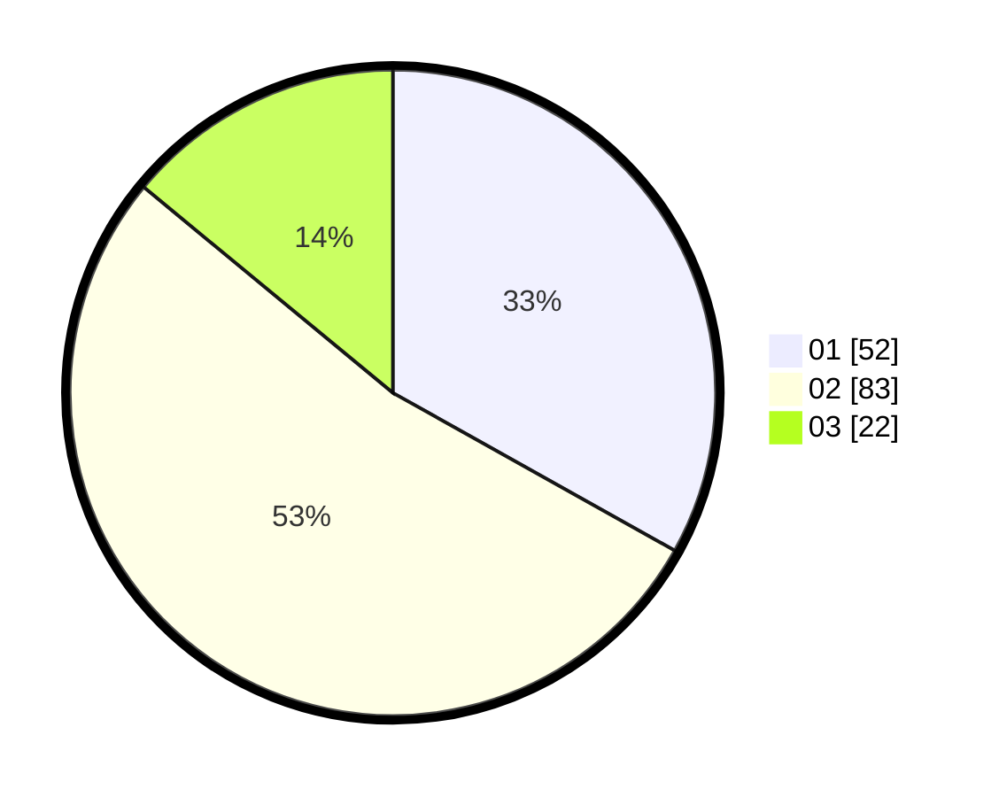

# Hasil

Hasil perolehan suara paslon dapat dilihat pada file paslon-01.txt, paslon-02.txt, dan paslon-03.txt.

Jika tidak ada, artinya data tersebut belum ada pada SIREKAP.

## Perolehan Suara

 * Paslon 01: **52**.
 * Paslon 02: **83**.
 * Paslon 03: **22**.

## Foto C Plano

https://sirekap-obj-formc.kpu.go.id/62b0/pemilu/ppwp/31/71/07/10/05/3171071005069-20240214-222555--e9a70f7e-d395-4b1a-8979-5a859d2e6fd4.jpg

https://sirekap-obj-formc.kpu.go.id/62b0/pemilu/ppwp/31/71/07/10/05/3171071005069-20240214-222625--83a8efe1-d238-47fa-b4ac-0ba544da9643.jpg

https://sirekap-obj-formc.kpu.go.id/62b0/pemilu/ppwp/31/71/07/10/05/3171071005069-20240214-222657--4a512a8d-323b-4ba2-9b6f-64d2d0e85709.jpg
