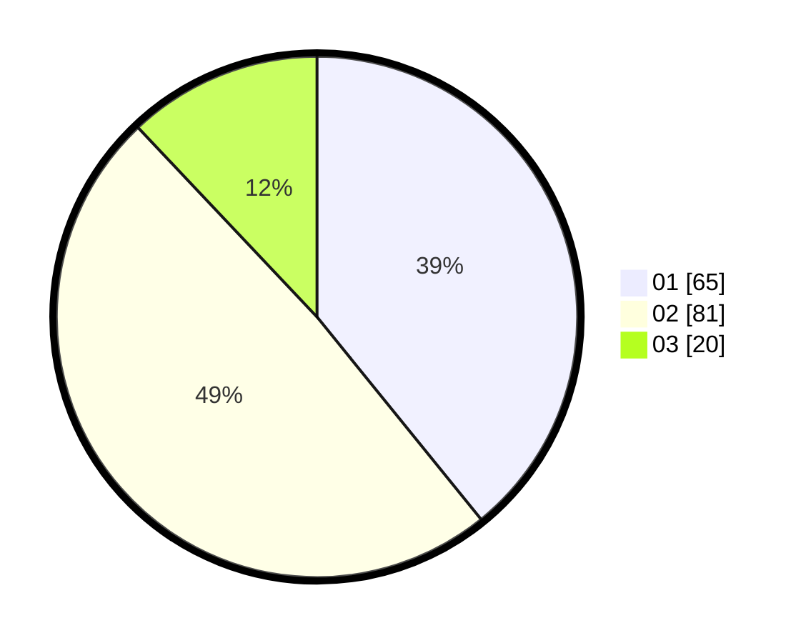

# Hasil

Hasil perolehan suara paslon dapat dilihat pada file paslon-01.txt, paslon-02.txt, dan paslon-03.txt.

Jika tidak ada, artinya data tersebut belum ada pada SIREKAP.

## Perolehan Suara

 * Paslon 01: **65**.
 * Paslon 02: **81**.
 * Paslon 03: **20**.

## Foto C Plano

https://sirekap-obj-formc.kpu.go.id/0562/pemilu/ppwp/31/71/07/10/05/3171071005070-20240215-225404--9d05e13a-2c8e-4194-865d-30462c1ab616.jpg

https://sirekap-obj-formc.kpu.go.id/0562/pemilu/ppwp/31/71/07/10/05/3171071005070-20240215-231629--7d3993a9-e733-4087-8fef-baeb9ee5ea10.jpg

https://sirekap-obj-formc.kpu.go.id/0562/pemilu/ppwp/31/71/07/10/05/3171071005070-20240215-231151--45c8b8cd-00c2-419c-b95e-0b8ad18709c3.jpg

## DATA PEMILIH TETAP

Jumlah pemilih dalam DPT: **279**.
 * L: **148**.
 * P: **131**.

## DATA PENGGUNA HAK PILIH

Jumlah pengguna hak pilih dalam DPT: **169**.
 * L: **77**.
 * P: **92**.

Jumlah pengguna hak pilih dalam DPTb: **0**.
 * L: **0**.
 * P: **0**.

Jumlah pengguna hak pilih dalam DPK: **1**.
 * L: **0**.
 * P: **1**.

Jumlah pengguna hak pilih: **170**.
 * L: **77**.
 * P: **93**.

## JUMLAH SUARA SAH DAN TIDAK SAH

JUMLAH SELURUH SUARA SAH: **166**.

JUMLAH SUARA TIDAK SAH: **4**.

JUMLAH SELURUH SUARA SAH DAN SUARA TIDAK SAH: **170**.
