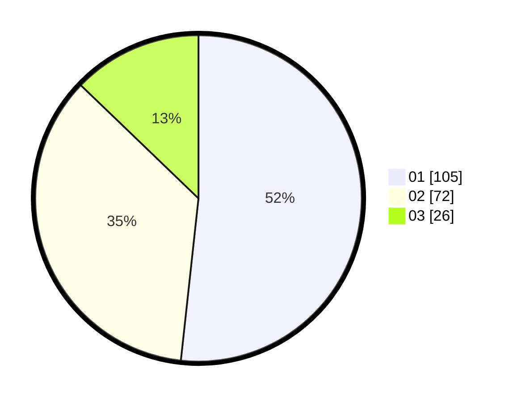

# Hasil

Hasil perolehan suara paslon dapat dilihat pada file paslon-01.txt, paslon-02.txt, dan paslon-03.txt.

Jika tidak ada, artinya data tersebut belum ada pada SIREKAP.

## Perolehan Suara

 * Paslon 01: **105**.
 * Paslon 02: **72**.
 * Paslon 03: **26**.

## Foto C Plano

https://sirekap-obj-formc.kpu.go.id/a39d/pemilu/ppwp/31/71/07/10/05/3171071005072-20240216-125702--b69d0967-c921-4946-b985-5b6a732802b1.jpg

https://sirekap-obj-formc.kpu.go.id/a39d/pemilu/ppwp/31/71/07/10/05/3171071005072-20240216-125709--1349da2b-3794-4a75-ae7b-57bf7b262910.jpg

https://sirekap-obj-formc.kpu.go.id/a39d/pemilu/ppwp/31/71/07/10/05/3171071005072-20240216-125705--9fe83d83-4b04-4071-91fc-74f8dbc54466.jpg

## DATA PEMILIH TETAP

Jumlah pemilih dalam DPT: **277**.
 * L: **145**.
 * P: **132**.

## DATA PENGGUNA HAK PILIH

Jumlah pengguna hak pilih dalam DPT: **204**.
 * L: **101**.
 * P: **103**.

Jumlah pengguna hak pilih dalam DPTb: **0**.
 * L: **0**.
 * P: **0**.

Jumlah pengguna hak pilih dalam DPK: **2**.
 * L: **2**.
 * P: **0**.

Jumlah pengguna hak pilih: **206**.
 * L: **103**.
 * P: **103**.

## JUMLAH SUARA SAH DAN TIDAK SAH

JUMLAH SELURUH SUARA SAH: **206**.

JUMLAH SUARA TIDAK SAH: **3**.

JUMLAH SELURUH SUARA SAH DAN SUARA TIDAK SAH: **209**.
