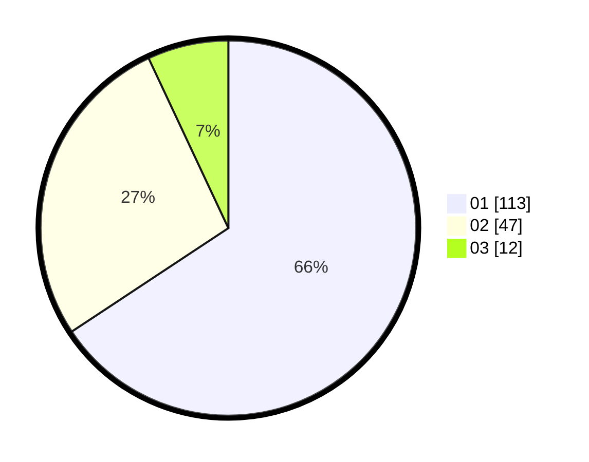

# Hasil

Hasil perolehan suara paslon dapat dilihat pada file paslon-01.txt, paslon-02.txt, dan paslon-03.txt.

Jika tidak ada, artinya data tersebut belum ada pada SIREKAP.

## Perolehan Suara

 * Paslon 01: **113**.
 * Paslon 02: **47**.
 * Paslon 03: **12**.

## Foto C Plano

https://sirekap-obj-formc.kpu.go.id/554c/pemilu/ppwp/31/71/07/10/05/3171071005081-20240214-155902--59d84ae4-2da1-4161-a9a2-cfca89e02fa7.jpg

https://sirekap-obj-formc.kpu.go.id/554c/pemilu/ppwp/31/71/07/10/05/3171071005081-20240214-160153--07acbec8-0ef9-4165-a0e3-10bf9c84de79.jpg

https://sirekap-obj-formc.kpu.go.id/554c/pemilu/ppwp/31/71/07/10/05/3171071005081-20240214-201452--9369a649-2a61-49c5-bdfe-9616ff27a0f2.jpg
