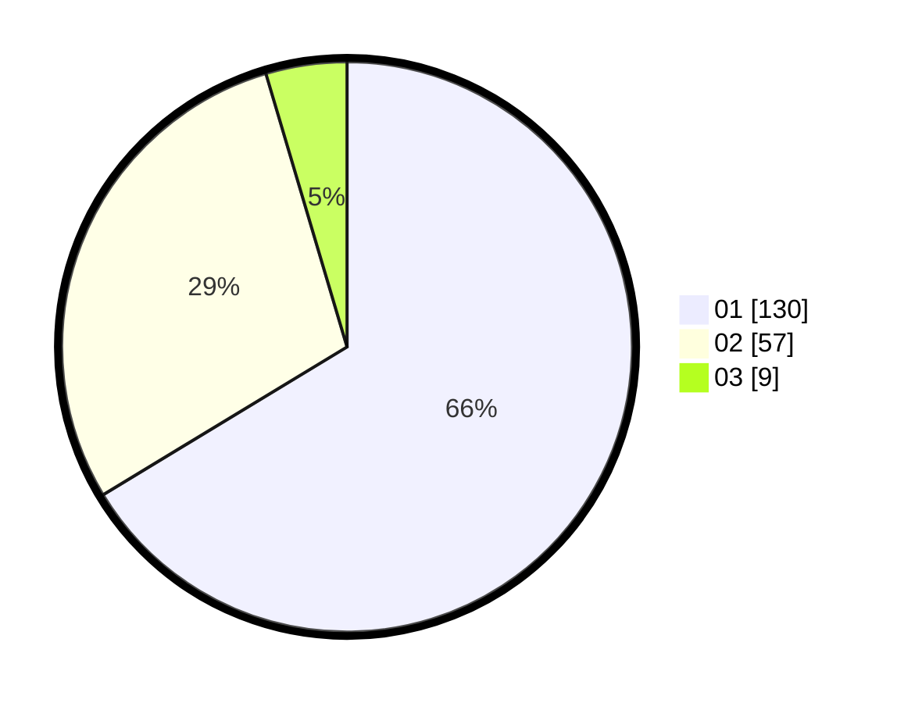

# Hasil

Hasil perolehan suara paslon dapat dilihat pada file paslon-01.txt, paslon-02.txt, dan paslon-03.txt.

Jika tidak ada, artinya data tersebut belum ada pada SIREKAP.

## Perolehan Suara

 * Paslon 01: **130**.
 * Paslon 02: **57**.
 * Paslon 03: **9**.

## Foto C Plano

https://sirekap-obj-formc.kpu.go.id/5eed/pemilu/ppwp/31/71/07/10/05/3171071005082-20240215-014633--b71c4f8d-598f-4bf1-972d-e05a3d5eb1e5.jpg

https://sirekap-obj-formc.kpu.go.id/5eed/pemilu/ppwp/31/71/07/10/05/3171071005082-20240215-015049--ea9f36c6-40d2-4919-925c-7112247fe6a6.jpg

https://sirekap-obj-formc.kpu.go.id/5eed/pemilu/ppwp/31/71/07/10/05/3171071005082-20240215-015201--e8d55c54-666d-4ff7-a3d1-295cc4632bdf.jpg
