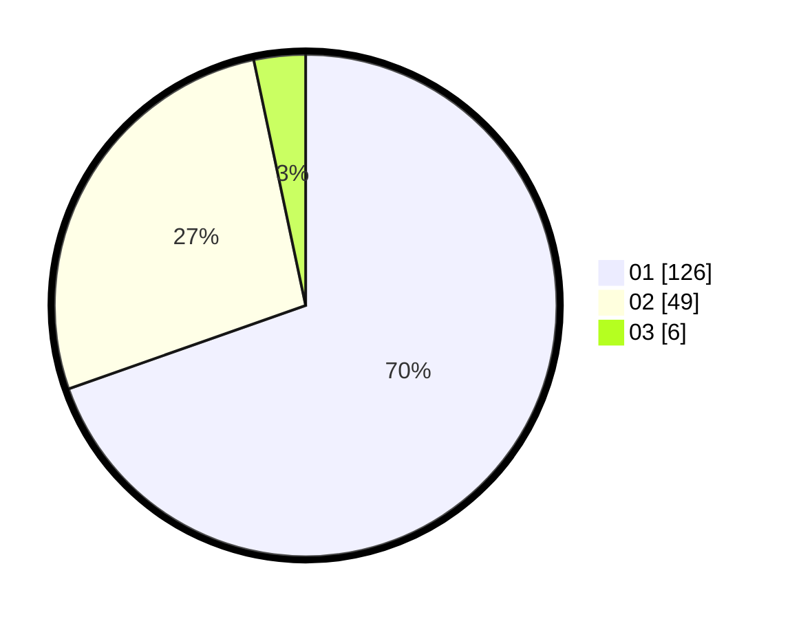

# Hasil

Hasil perolehan suara paslon dapat dilihat pada file paslon-01.txt, paslon-02.txt, dan paslon-03.txt.

Jika tidak ada, artinya data tersebut belum ada pada SIREKAP.

## Perolehan Suara

 * Paslon 01: **126**.
 * Paslon 02: **49**.
 * Paslon 03: **6**.

## Foto C Plano

https://sirekap-obj-formc.kpu.go.id/2001/pemilu/ppwp/31/71/07/10/05/3171071005084-20240214-221052--2f9d2fa9-a758-448b-8b1d-f022d8c0b640.jpg

https://sirekap-obj-formc.kpu.go.id/2001/pemilu/ppwp/31/71/07/10/05/3171071005084-20240214-222617--e4b3d3bb-5b5c-428d-a8bb-3d8367e07b83.jpg

https://sirekap-obj-formc.kpu.go.id/2001/pemilu/ppwp/31/71/07/10/05/3171071005084-20240214-222913--6de4087c-ce6b-4b05-8f7b-a0c2627d2b2a.jpg
