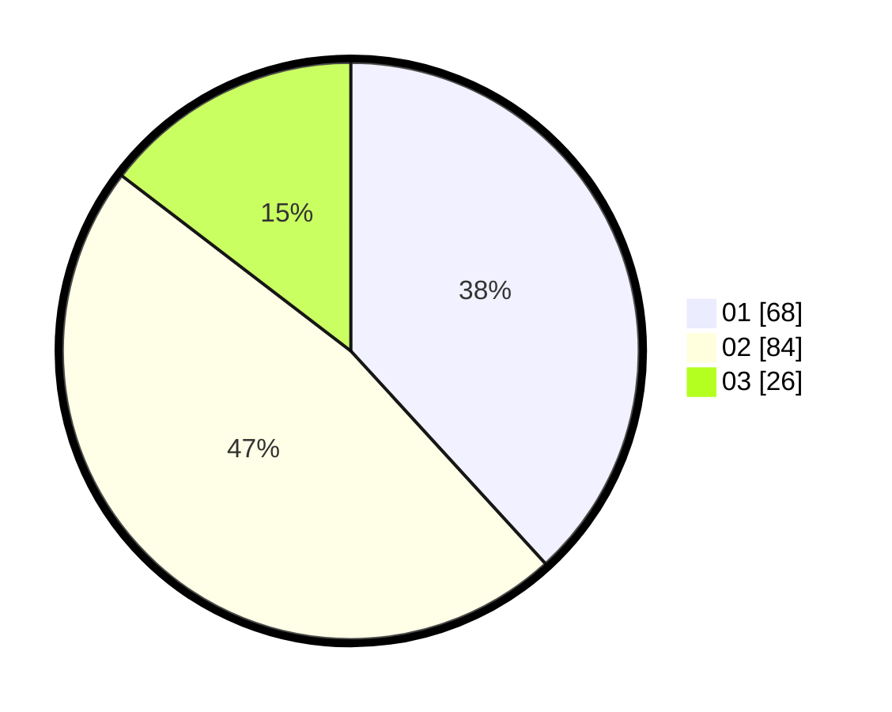

# Hasil

Hasil perolehan suara paslon dapat dilihat pada file paslon-01.txt, paslon-02.txt, dan paslon-03.txt.

Jika tidak ada, artinya data tersebut belum ada pada SIREKAP.

## Perolehan Suara

 * Paslon 01: **68**.
 * Paslon 02: **84**.
 * Paslon 03: **26**.

## Foto C Plano

https://sirekap-obj-formc.kpu.go.id/e450/pemilu/ppwp/31/71/07/10/05/3171071005092-20240215-013257--2ce05d7c-337a-4ca4-966d-df20487256ba.jpg

https://sirekap-obj-formc.kpu.go.id/e450/pemilu/ppwp/31/71/07/10/05/3171071005092-20240214-155835--9919d2b6-a3b3-41cf-8f1f-597f03e9a3ff.jpg

https://sirekap-obj-formc.kpu.go.id/e450/pemilu/ppwp/31/71/07/10/05/3171071005092-20240214-184500--113963a5-bd5e-4f50-a896-fcf0eb62d008.jpg

## DATA PEMILIH TETAP

Jumlah pemilih dalam DPT: **265**.
 * L: **131**.
 * P: **134**.

## DATA PENGGUNA HAK PILIH

Jumlah pengguna hak pilih dalam DPT: **177**.
 * L: **84**.
 * P: **93**.

Jumlah pengguna hak pilih dalam DPTb: **0**.
 * L: **0**.
 * P: **0**.

Jumlah pengguna hak pilih dalam DPK: **4**.
 * L: **0**.
 * P: **4**.

Jumlah pengguna hak pilih: **181**.
 * L: **84**.
 * P: **97**.

## JUMLAH SUARA SAH DAN TIDAK SAH

JUMLAH SELURUH SUARA SAH: **178**.

JUMLAH SUARA TIDAK SAH: **3**.

JUMLAH SELURUH SUARA SAH DAN SUARA TIDAK SAH: **181**.
